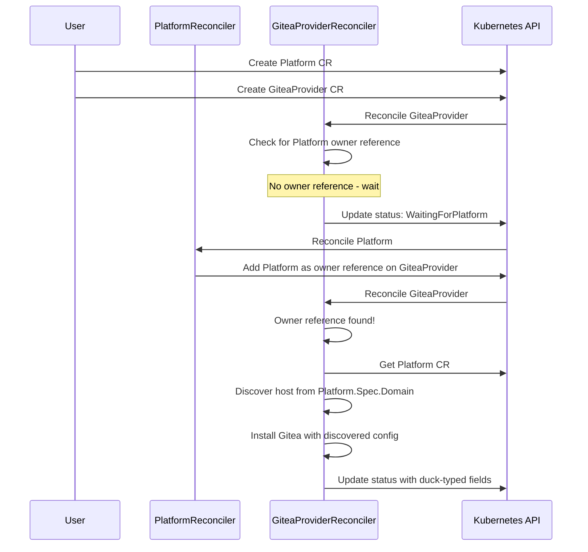

# IDP Builder Architecture

**Version:** 2.0  
**Last Updated:** January 2026  
**Status:** Implementation in Progress

## Executive Summary

IDP Builder is a Kubernetes-native platform that enables organizations to quickly spin up complete Internal Developer Platforms (IDPs) with minimal dependencies. At its core, IDP Builder uses a **pluggable, provider-based architecture** powered by **duck typing** to offer maximum flexibility while maintaining simplicity.

This document describes the high-level technical architecture, focusing on how the pluggable capabilities via duck-typed Custom Resource Definitions (CRDs) enable extensibility and customization.

## What Makes IDP Builder Unique

IDP Builder stands out through its innovative approach to platform composition:

1. **Duck-Typed Providers**: Instead of rigid interfaces, providers expose standard status fields that can be consumed by any component, enabling true plug-and-play architecture
2. **Composable Platform**: Mix and match Git providers (Gitea, GitHub, GitLab), Gateways (Nginx, Envoy, Istio), and GitOps tools (ArgoCD, Flux)
3. **Minimal Dependencies**: Only Docker is required at runtime for local development
4. **Kubernetes-Native**: Built on standard Kubernetes patterns (CRDs, controllers, reconciliation loops)
5. **Two Deployment Modes**: CLI-driven for development, GitOps-driven for production

## High-Level Architecture

### Architecture Overview

```
┌─────────────────────────────────────────────────────────────────┐
│                     Infrastructure Layer                         │
│  ┌────────────────────────┐  ┌────────────────────────────────┐ │
│  │ CLI-Driven (Dev)       │  │ GitOps-Driven (Production)     │ │
│  │ • idpbuilder creates   │  │ • Pre-provisioned cluster      │ │
│  │   Kind cluster         │  │ • Helm/kubectl install         │ │
│  │ • Deploys controllers  │  │ • GitOps manages CRs           │ │
│  └────────────────────────┘  └────────────────────────────────┘ │
└─────────────────────────────────────────────────────────────────┘
                              ↓
┌─────────────────────────────────────────────────────────────────┐
│                    Platform Controllers (On-Cluster)             │
│  ┌──────────────────────────────────────────────────────────┐   │
│  │ PlatformReconciler                                       │   │
│  │ • Orchestrates provider installation                     │   │
│  │ • Aggregates component status                            │   │
│  │ • Creates GitRepository CRs for bootstrap content        │   │
│  └──────────────────────────────────────────────────────────┘   │
│                                                                  │
│  ┌────────────────────┐  ┌────────────────────┐  ┌───────────┐ │
│  │ Git Providers      │  │ Gateway Providers  │  │ GitOps    │ │
│  │ (Duck-Typed)       │  │ (Duck-Typed)       │  │ Providers │ │
│  │                    │  │                    │  │ (Duck-    │ │
│  │ • GiteaProvider    │  │ • NginxGateway     │  │  Typed)   │ │
│  │ • GitHubProvider   │  │ • EnvoyGateway     │  │           │ │
│  │ • GitLabProvider   │  │ • IstioGateway     │  │ • ArgoCD  │ │
│  │                    │  │                    │  │ • Flux    │ │
│  │ Common fields:     │  │ Common fields:     │  │           │ │
│  │ • endpoint         │  │ • ingressClassName │  │ Common:   │ │
│  │ • internalEndpoint │  │ • loadBalancer     │  │ • endpoint│ │
│  │ • credentials      │  │ • internalEndpoint │  │ • internal│ │
│  └────────────────────┘  └────────────────────┘  └───────────┘ │
└─────────────────────────────────────────────────────────────────┘
                              ↓
┌─────────────────────────────────────────────────────────────────┐
│                       Platform Services                          │
│  • Git servers (Gitea/GitHub/GitLab)                            │
│  • Ingress controllers (Nginx/Envoy/Istio)                      │
│  • GitOps engines (ArgoCD/Flux)                                 │
│  • User applications managed by GitOps                          │
└─────────────────────────────────────────────────────────────────┘
```

### Core Components

#### 1. Platform CR (Orchestrator)

The `Platform` Custom Resource is the top-level abstraction that orchestrates the entire platform:

```yaml
apiVersion: idpbuilder.cnoe.io/v1alpha2
kind: Platform
metadata:
  name: localdev
  namespace: idpbuilder-system
spec:
  domain: cnoe.localtest.me
  components:
    gitProviders:
      - name: gitea-local
        kind: GiteaProvider
        namespace: idpbuilder-system
    gateways:
      - name: nginx-gateway
        kind: NginxGateway
        namespace: idpbuilder-system
    gitOpsProviders:
      - name: argocd
        kind: ArgoCDProvider
        namespace: idpbuilder-system
```

**Key Responsibilities:**
- References provider CRs by name, kind, and namespace
- Provides platform-level configuration (domain, TLS, etc.)
- Aggregates and reports overall platform health
- Establishes owner references on provider CRs

#### 2. Provider CRs (Pluggable Components)

Providers are independent Custom Resources that manage specific platform capabilities. Each provider type shares common **duck-typed status fields** that enable interoperability.

## Duck Typing: The Secret to Extensibility

### What is Duck Typing?

Duck typing is a design pattern that enables different provider implementations to work together without tight coupling. The name comes from the phrase:

> "If it walks like a duck and quacks like a duck, it's a duck."

In IDP Builder's context: **If a provider has the expected status fields, it can be used interchangeably with other providers of the same type.**

### How Duck Typing Works in IDP Builder

Instead of requiring providers to implement a shared Go interface, IDP Builder uses **duck-typed status fields**. Each provider type exposes a set of common status fields in their Custom Resource status. Other controllers access these fields using unstructured access patterns.

```go
// Controllers access providers without knowing their specific type
provider := &unstructured.Unstructured{}
provider.SetGroupVersionKind(gitServerRef.GroupVersionKind())

// Fetch the provider (could be Gitea, GitHub, GitLab, etc.)
err := r.Get(ctx, providerKey, provider)

// Extract duck-typed status fields - works for ANY Git provider
endpoint, _, _ := unstructured.NestedString(provider.Object, "status", "endpoint")
internalEndpoint, _, _ := unstructured.NestedString(provider.Object, "status", "internalEndpoint")
credsRef, _, _ := unstructured.NestedFieldNoCopy(provider.Object, "status", "credentialsSecretRef")

// Use the provider - implementation details don't matter!
gitClient := git.NewClient(endpoint, internalEndpoint, credsRef)
```

### Standard Duck-Typed Fields by Provider Type

#### Git Providers (GiteaProvider, GitHubProvider, GitLabProvider)

All Git providers **must** expose these status fields:

```yaml
status:
  # External URL for web UI and git clone operations
  endpoint: "https://gitea.cnoe.localtest.me"
  
  # Cluster-internal URL for API access
  internalEndpoint: "http://gitea-http.gitea.svc.cluster.local:3000"
  
  # Reference to secret containing access credentials
  credentialsSecretRef:
    name: "gitea-admin-secret"
    namespace: "gitea"
    key: "token"
  
  # Standard Kubernetes condition
  conditions:
    - type: Ready
      status: "True"
```

**Why this matters:** A `GitRepository` controller can work with *any* Git provider (Gitea, GitHub, GitLab) without modification. It just reads these standard fields and creates repositories accordingly.

#### Gateway Providers (NginxGateway, EnvoyGateway, IstioGateway)

All Gateway providers **must** expose these status fields:

```yaml
status:
  # Ingress class name for routing
  ingressClassName: "nginx"
  
  # External endpoint for accessing services
  loadBalancerEndpoint: "http://172.18.0.2"
  
  # Cluster-internal API endpoint
  internalEndpoint: "http://ingress-nginx-controller.ingress-nginx.svc"
  
  # Standard Kubernetes condition
  conditions:
    - type: Ready
      status: "True"
```

**Why this matters:** Platform services (ArgoCD, Gitea) can discover which ingress class to use without knowing whether they're running on Nginx, Envoy, or Istio.

#### GitOps Providers (ArgoCDProvider, FluxProvider)

All GitOps providers **must** expose these status fields:

```yaml
status:
  # External URL for web UI
  endpoint: "https://argocd.cnoe.localtest.me"
  
  # Cluster-internal API endpoint
  internalEndpoint: "http://argocd-server.argocd.svc.cluster.local"
  
  # Admin credentials for API access
  credentialsSecretRef:
    name: "argocd-admin-secret"
    namespace: "argocd"
    key: "password"
  
  # Standard Kubernetes condition
  conditions:
    - type: Ready
      status: "True"
```

**Why this matters:** The Platform can create GitOps applications without knowing whether it's using ArgoCD or Flux.

### Benefits of Duck Typing

1. **True Plug-and-Play**: Swap Gitea for GitHub without changing any other components
2. **No Interface Lock-In**: Providers don't implement a shared Go interface, reducing coupling
3. **Runtime Flexibility**: Platform can reference different provider kinds dynamically
4. **Easy Extension**: Add new provider types without modifying the Platform CR
5. **Independent Development**: Provider teams work independently
6. **Simplified Integration**: Consumer controllers only need to know about standard fields

### Example: Multiple Git Providers

Duck typing enables scenarios like this:

```yaml
apiVersion: idpbuilder.cnoe.io/v1alpha2
kind: Platform
metadata:
  name: hybrid-platform
spec:
  domain: example.com
  components:
    gitProviders:
      # In-cluster Gitea for development
      - name: gitea-dev
        kind: GiteaProvider
        namespace: idpbuilder-system
      # External GitHub for production
      - name: github-prod
        kind: GitHubProvider
        namespace: idpbuilder-system
    # ... other components
```

A single platform can use **both** Gitea and GitHub simultaneously. The `GitRepository` controller works with both because they expose the same duck-typed fields.

## Provider Lifecycle and Coordination

### Owner Reference Pattern

Providers use an **owner reference pattern** to discover configuration from the Platform:



**Key Benefits:**
- Centralized configuration in Platform CR
- Reduced duplication across providers
- Dynamic discovery of configuration
- Clear lifecycle management

### Provider States

Providers progress through these states:

1. **WaitingForPlatform**: Provider waiting for Platform to add owner reference
2. **Discovering**: Provider discovering configuration from Platform
3. **Installing**: Provider installing its managed component
4. **Ready**: Provider fully operational with duck-typed fields populated
5. **Failed**: Installation or operation failed

## Technical Specifications

### Custom Resource Definitions

#### Platform API

```go
type PlatformSpec struct {
    // Domain is the base domain for the platform
    Domain string `json:"domain"`
    
    // Components defines the platform component configuration
    Components PlatformComponents `json:"components"`
}

type PlatformComponents struct {
    // GitProviders is a list of Git provider references
    GitProviders []ProviderReference `json:"gitProviders,omitempty"`
    
    // Gateways is a list of Gateway provider references
    Gateways []ProviderReference `json:"gateways,omitempty"`
    
    // GitOpsProviders is a list of GitOps provider references
    GitOpsProviders []ProviderReference `json:"gitOpsProviders,omitempty"`
}

type ProviderReference struct {
    // Name is the name of the provider CR
    Name string `json:"name"`
    
    // Kind is the kind of the provider CR (e.g., GiteaProvider, NginxGateway)
    Kind string `json:"kind"`
    
    // Namespace is the namespace of the provider CR
    Namespace string `json:"namespace"`
}
```

#### Provider API Example (GiteaProvider)

```go
type GiteaProviderStatus struct {
    // Standard Kubernetes conditions
    Conditions []metav1.Condition `json:"conditions,omitempty"`
    
    // Duck-typed fields - REQUIRED for Git providers
    Endpoint string `json:"endpoint,omitempty"`
    InternalEndpoint string `json:"internalEndpoint,omitempty"`
    CredentialsSecretRef *SecretReference `json:"credentialsSecretRef,omitempty"`
    
    // Provider-specific fields
    Installed bool `json:"installed,omitempty"`
    Version string `json:"version,omitempty"`
    Phase string `json:"phase,omitempty"`
}
```

### Controller Responsibilities

#### PlatformReconciler

- Adds owner references to provider CRs
- Aggregates status from all providers
- Creates GitRepository CRs for bootstrap content
- Updates Platform status with overall health

#### Provider Reconcilers (GiteaProvider, NginxGateway, ArgoCDProvider, etc.)

- Waits for Platform owner reference
- Discovers configuration from Platform CR
- Installs and configures the provider's component (Gitea, Nginx, ArgoCD)
- Populates duck-typed status fields
- Manages component lifecycle (updates, scaling, etc.)

#### GitRepositoryReconciler

- Uses duck-typed Git provider interface
- Creates repositories in any Git provider
- Syncs content from embedded resources or external sources

## Deployment Modes

### Mode 1: CLI-Driven (Development)

**Use Case:** Local development, demos, testing

```bash
# Single command to create entire platform
idpbuilder create --name localdev
```

Behind the scenes:
1. CLI creates Kind cluster
2. CLI deploys controller manager
3. CLI creates Platform and Provider CRs
4. Controllers reconcile and install components
5. CLI reports status to user

**Benefits:**
- Minimal learning curve
- Quick feedback loop
- Single dependency (Docker)
- Opinionated defaults

### Mode 2: GitOps-Driven (Production)

**Use Case:** Production, staging, team environments

```bash
# Install controllers
helm install idpbuilder-controllers cnoe-io/idpbuilder-controllers

# Deploy CRs via GitOps (ArgoCD/Flux)
kubectl apply -f platform.yaml
```

**Benefits:**
- Fully declarative
- GitOps native
- Auditable (Git history)
- No CLI required
- Multi-cluster support

## Extensibility Points

### Adding a New Provider Type

To add support for a new provider (e.g., GitLab):

1. **Define the CRD with duck-typed status fields:**

```go
type GitLabProviderStatus struct {
    Conditions []metav1.Condition `json:"conditions,omitempty"`
    
    // Duck-typed fields - same as other Git providers
    Endpoint string `json:"endpoint,omitempty"`
    InternalEndpoint string `json:"internalEndpoint,omitempty"`
    CredentialsSecretRef *SecretReference `json:"credentialsSecretRef,omitempty"`
    
    // GitLab-specific fields
    GroupID int `json:"groupID,omitempty"`
    // ... other GitLab-specific fields
}
```

2. **Implement the reconciler:**

```go
func (r *GitLabProviderReconciler) Reconcile(ctx context.Context, req ctrl.Request) {
    // 1. Wait for Platform owner reference
    // 2. Discover configuration from Platform
    // 3. Install GitLab
    // 4. Populate duck-typed status fields
    // 5. Update status
}
```

3. **Reference it in Platform CR:**

```yaml
spec:
  components:
    gitProviders:
      - name: gitlab-instance
        kind: GitLabProvider  # New provider type!
        namespace: idpbuilder-system
```

**No changes needed to:**
- Platform CR schema
- GitRepository controller
- Other providers

This is the power of duck typing!

### Adding Custom Components

Organizations can extend IDP Builder with custom components:

1. Create a custom provider CRD
2. Implement a reconciler that exposes appropriate duck-typed fields
3. Reference it in the Platform CR

Example: Adding Vault for secrets management:

```yaml
apiVersion: idpbuilder.cnoe.io/v1alpha2
kind: VaultProvider
metadata:
  name: vault
spec:
  namespace: vault
# Status would expose duck-typed fields for secrets providers
```

## Observability and Debugging

### Status Conditions

All providers use standard Kubernetes conditions:

```yaml
status:
  conditions:
    - type: Ready
      status: "True"
      reason: ReconciliationSucceeded
      message: "Gitea installed and operational"
      lastTransitionTime: "2026-01-07T10:00:00Z"
```

### kubectl Commands

```bash
# Check platform status
kubectl get platform -n idpbuilder-system

# Check all providers
kubectl get giteaprovider,nginxgateway,argocdprovider -n idpbuilder-system

# Detailed provider status
kubectl describe giteaprovider gitea-local -n idpbuilder-system

# Check events
kubectl get events --field-selector involvedObject.name=gitea-local
```

### Troubleshooting

Common issues and their solutions:

| Issue | Check | Solution |
|-------|-------|----------|
| Provider stuck in WaitingForPlatform | Owner references | Ensure Platform references the provider |
| Provider in ConfigurationError | Platform domain | Set required fields in Platform CR |
| Provider not discovered | Provider namespace | Verify namespace matches Platform reference |

## Performance and Scalability

### Resource Footprint

**Minimal deployment (local dev):**
- Kind cluster: ~2GB RAM
- Controllers: ~100MB RAM
- Gitea: ~512MB RAM
- Nginx: ~100MB RAM
- ArgoCD: ~512MB RAM

**Total: ~3.2GB RAM** for a full IDP

### Scaling Characteristics

- Controllers use leader election for HA
- Providers can be scaled independently
- Platform CR supports multiple providers of the same type
- Reconciliation loops are efficient (watch-based, not polling)

## Security Considerations

### Credential Management

- Credentials stored in Kubernetes Secrets
- Duck-typed `credentialsSecretRef` enables secure credential passing
- Providers never expose credentials in status

### RBAC

Controllers require minimal permissions:
- Read/write their own CRDs
- Read Platform CRs
- Create/manage Kubernetes resources in provider namespaces

### Network Policies

Providers can be isolated using network policies:
- Gitea only accessible via ingress
- ArgoCD API only accessible from authorized clients
- Cross-provider communication via service mesh (optional)

## Future Enhancements

### Planned Features

1. **Multi-cluster support** via vCluster or Cluster API
2. **Provider marketplace** for discovering community providers
3. **Advanced health checks** and automatic recovery
4. **Backup and restore** for platform state
5. **Cost tracking and optimization** per provider
6. **Policy enforcement** via OPA or Kyverno integration

### Experimental Features

- **AI-assisted configuration** for provider selection
- **Progressive delivery** with Flagger integration
- **Service mesh** integration for enhanced security
- **Multi-tenancy** with namespace isolation

## Conclusion

IDP Builder's architecture demonstrates that powerful platforms don't require complex frameworks. By leveraging:

1. **Duck typing** for provider interoperability
2. **Kubernetes-native patterns** for reliability
3. **Composability** for flexibility
4. **Separation of concerns** between infrastructure and services

IDP Builder provides a solid foundation that grows with your organization's needs - from a single developer's laptop to multi-cluster production deployments.

The pluggable architecture via duck-typed CRDs is the key innovation that enables this flexibility while maintaining simplicity.

## References

- [Controller Architecture Specification](/docs/specs/controller-architecture-spec.html) - Detailed v2 architecture spec
- [Pluggable Packages Proposal](/docs/specs/pluggable-packages.html) - Package management design
- [Platform API Reference](/docs/api/reference.html) - Complete API documentation
- [Examples](/docs/examples/README.html) - Example configurations

## Appendix: Complete Example

Here's a complete example showing the power of the pluggable architecture:

```yaml
# Platform with multiple providers of each type
apiVersion: idpbuilder.cnoe.io/v1alpha2
kind: Platform
metadata:
  name: enterprise-platform
spec:
  domain: idp.company.com
  components:
    # Multiple Git providers for different purposes
    gitProviders:
      - name: gitea-dev
        kind: GiteaProvider
        namespace: idpbuilder-system
      - name: github-prod
        kind: GitHubProvider
        namespace: idpbuilder-system
    
    # Multiple gateways for different traffic types
    gateways:
      - name: nginx-public
        kind: NginxGateway
        namespace: idpbuilder-system
      - name: istio-mesh
        kind: IstioGateway
        namespace: idpbuilder-system
    
    # Multiple GitOps tools
    gitOpsProviders:
      - name: argocd-apps
        kind: ArgoCDProvider
        namespace: idpbuilder-system
      - name: flux-infra
        kind: FluxProvider
        namespace: idpbuilder-system
```

This configuration leverages duck typing to create a sophisticated platform where:
- Development teams use Gitea for rapid iteration
- Production deployments use GitHub for compliance
- Public APIs route through Nginx
- Internal services use Istio service mesh
- Applications deploy via ArgoCD
- Infrastructure manages via Flux

**All controlled by a single Platform CR and enabled by duck-typed providers.**
