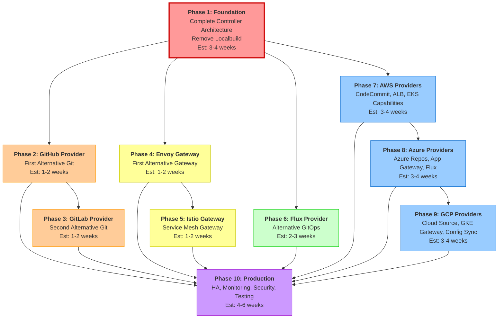

# Phased Implementation Plan for IDP Builder Technical Specifications

**Date:** January 7, 2026  
**Status:** Active Implementation Roadmap  
**Based On:** Technical specifications analysis and current implementation status

## Executive Summary

This document provides a phased implementation plan to complete the three technical specifications for IDP Builder:

1. **Pluggable and Configurable Packaging** (Status: Implemented ✅)
2. **Controller-Based Architecture** (Status: Partially Implemented 🚧)
3. **Hyperscaler Provider Integration** (Status: Not Started 🔲)

The plan sequences work into testable, incremental phases that build upon each other without requiring specific dates. Each phase delivers demonstrable functionality that can be validated independently.

## Specification Status Analysis

### 1. Pluggable and Configurable Packaging ✅ **COMPLETE**

**Original Proposal Date:** Original proposal (earliest)  
**Current Status:** Implemented

**Completed Features:**
- ✅ ArgoCD-based package management
- ✅ In-cluster Git server (Gitea) for GitOps workflows
- ✅ Runtime content generation
- ✅ Support for Helm charts, Kustomize, and raw manifests
- ✅ Local file handling with `files://` protocol
- ✅ Custom packages via `--package` flag
- ✅ ArgoCD configuration via `--argocd-config` flag

**No Further Work Required:** This specification is fully implemented and operational.

---

### 2. Controller-Based Architecture 🚧 **PARTIAL**

**Specification Date:** December 19, 2025  
**Current Status:** Phases 1.1, 1.2, and partial 1.3 complete

**What's Implemented:**

✅ **Phase 1.1: GiteaProvider (Complete)**
- GiteaProvider CRD and controller
- Git provider duck-typing utilities
- Gitea installation and configuration
- Status management

✅ **Phase 1.2: NginxGateway and Platform Controller (Complete)**
- NginxGateway CRD and controller
- Gateway provider duck-typing utilities
- PlatformReconciler with Git and Gateway aggregation
- Documentation and examples

✅ **Phase 1.3: ArgoCDProvider (Complete)**
- ArgoCDProvider CRD and controller
- GitOps provider duck-typing utilities
- ArgoCD installation and configuration

**Critical Missing Components:**

❌ **Owner Reference Pattern** (Spec lines 344-643)
- Platform must establish owner references to providers
- Providers must wait for Platform before reconciling
- Configuration discovery from Platform resource

❌ **Platform Bootstrap Repository Creation**
- Platform must create GitRepository CRs for bootstrap apps
- Platform must create ArgoCD Applications
- Move logic from Localbuild controller

❌ **CLI Integration for All Providers**
- CLI creates GiteaProvider ✅
- CLI creates NginxGateway ❌
- CLI creates ArgoCDProvider ❌
- Platform references all provider types ❌

❌ **Localbuild Controller Removal**
- CLI still creates Localbuild CR
- Localbuild controller still handles core installation
- Migration to v1alpha2-only not complete

**Remaining Provider Types:**

🔲 **Phase 3: GitHub Provider**
🔲 **Phase 4: GitLab Provider**
🔲 **Phase 5: Envoy Gateway Provider**
🔲 **Phase 6: Istio Gateway Provider**
🔲 **Phase 7: Flux Provider**
🔲 **Phase 8: Production Features**

---

### 3. Hyperscaler Provider Integration 🔲 **NOT STARTED**

**Specification Date:** December 20, 2025  
**Current Status:** Proposal phase, no implementation

**Required Providers:**

**AWS Providers:**
🔲 CodeCommit Provider (Git)
🔲 AWS Load Balancer Controller Provider (Gateway)
🔲 EKS Capabilities Provider (GitOps)

**Azure Providers:**
🔲 Azure DevOps Repos Provider (Git)
🔲 Azure Application Gateway Provider (Gateway)
🔲 Flux Azure Provider (GitOps)

**GCP Providers:**
🔲 Cloud Source Repositories Provider (Git)
🔲 GKE Gateway Controller Provider (Gateway)
🔲 Config Sync Provider (GitOps)

**Common Requirements:**
- Duck-typed status field implementation
- Cloud IAM integration (IRSA, Workload Identity)
- Owner reference pattern compliance
- Platform configuration discovery
- Cloud-specific authentication setup

---

## Phased Implementation Plan

### Phase 1: Complete Controller Architecture Foundation ⚠️ **HIGHEST PRIORITY**

**Objective:** Finish the core controller-based architecture (v1alpha2) and remove v1alpha1 (Localbuild)

**Dependencies:** None (foundation for all other work)

**Deliverables:**

#### 1.1 Implement Owner Reference Pattern
**Why:** This is the foundation of the new architecture. Without it, providers won't coordinate properly.

**Tasks:**
- [ ] Platform controller adds owner references to all provider CRs
- [ ] GiteaProvider waits for Platform owner reference before reconciling
- [ ] NginxGateway waits for Platform owner reference before reconciling
- [ ] ArgoCDProvider waits for Platform owner reference before reconciling
- [ ] Providers discover configuration from Platform resource
- [ ] Add comprehensive unit tests for owner reference logic

**Testing:**
```bash
# Create providers first (should wait)
kubectl apply -f giteaprovider.yaml
kubectl get giteaprovider -o jsonpath='{.status.phase}'
# Should show: "WaitingForPlatform"

# Create platform (should trigger provider reconciliation)
kubectl apply -f platform.yaml
kubectl get giteaprovider -o jsonpath='{.status.phase}'
# Should show: "Installing" or "Ready"
```

**Success Criteria:**
- Providers enter "WaitingForPlatform" phase without owner reference
- Platform successfully adds owner references to all providers
- Providers transition to "Installing" → "Ready" after owner reference added
- All unit tests pass

---

#### 1.2 Platform Bootstrap Repository Creation
**Why:** Platform must create GitRepository and ArgoCD Application CRs (currently done by Localbuild)

**Tasks:**
- [ ] Move `reconcileGitRepo()` from Localbuild to Platform controller
- [ ] Move `reconcileEmbeddedApp()` from Localbuild to Platform controller
- [ ] Update bootstrap logic to use duck-typed git provider access
- [ ] Platform creates GitRepository CRs for argocd, gitea, nginx
- [ ] Platform creates ArgoCD Applications for bootstrap apps
- [ ] Add unit tests for bootstrap repository creation

**Testing:**
```bash
# After platform becomes ready
kubectl get gitrepository
# Should show: argocd, gitea, nginx

kubectl get applications -n argocd
# Should show bootstrap applications
```

**Success Criteria:**
- GitRepository CRs created by Platform controller
- ArgoCD Applications created by Platform controller
- Bootstrap apps sync successfully in ArgoCD
- All unit tests pass

---

#### 1.3 Complete CLI Integration
**Why:** CLI must create all provider CRs, not just GiteaProvider

**Tasks:**
- [ ] Add `createNginxGateway()` function in build.go
- [ ] Add `createArgoCDProvider()` function in build.go
- [ ] Update `createPlatform()` to reference all provider types
- [ ] Update CLI Run() to call all provider creation functions
- [ ] Add CLI flags for provider configuration (optional)

**Testing:**
```bash
# Run CLI
idpbuilder create

# Verify all CRs created
kubectl get giteaprovider
kubectl get nginxgateway
kubectl get argocdprovider
kubectl get platform

# Verify Platform references all providers
kubectl get platform -o yaml | grep -A 10 "components:"
```

**Success Criteria:**
- CLI creates GiteaProvider, NginxGateway, and ArgoCDProvider CRs
- Platform CR references all three provider types
- All providers become Ready
- Bootstrap workflow completes successfully

---

#### 1.4 GitOps Provider Aggregation
**Why:** Platform status must include GitOps provider health

**Tasks:**
- [ ] Add `aggregateGitOpsProviders()` method to Platform controller
- [ ] Call aggregation method in Platform Reconcile loop
- [ ] Update Platform Ready condition to include GitOps providers
- [ ] Add RBAC permissions for reading ArgoCDProvider
- [ ] Add unit tests for GitOps aggregation

**Testing:**
```bash
kubectl get platform -o jsonpath='{.status.providers.gitOpsProviders}'
# Should show ArgoCD provider status
```

**Success Criteria:**
- Platform.Status.Providers includes GitOps providers
- Platform Ready condition considers GitOps provider health
- All unit tests pass

---

#### 1.5 Remove Localbuild Controller
**Why:** Complete migration to v1alpha2 architecture

**Tasks:**
- [ ] Remove Localbuild CR creation from build.go (lines 281-318)
- [ ] Unregister LocalbuildReconciler from controllers/run.go
- [ ] Delete pkg/controllers/localbuild/ directory
- [ ] Add deprecation notice to v1alpha1 Localbuild CRD
- [ ] Update documentation to use v1alpha2
- [ ] Create migration guide from v1alpha1 to v1alpha2

**Testing:**
```bash
# Run CLI (should work without Localbuild)
idpbuilder create

# Verify no Localbuild CR exists
kubectl get localbuild
# Should show: No resources found

# Verify all functionality works
kubectl get platform,giteaprovider,nginxgateway,argocdprovider
# All should be Ready
```

**Success Criteria:**
- CLI works without creating Localbuild CR
- All features work with v1alpha2 architecture only
- Integration tests pass
- E2E tests pass
- Documentation updated

---

**Phase 1 Estimated Effort:** 3-4 weeks
**Phase 1 Validation:** Full E2E test with `idpbuilder create` using only v1alpha2 architecture

---

### Phase 2: GitHub Provider (First Alternative Git Provider)

**Objective:** Add GitHub as external Git provider to validate duck-typing with external services

**Dependencies:** Phase 1 complete (foundation must be stable)

**Deliverables:**

#### 2.1 GitHubProvider CRD and Controller
**Tasks:**
- [ ] Create `api/v1alpha2/githubprovider_types.go`
- [ ] Define duck-typed status fields (endpoint, internalEndpoint, credentialsRef)
- [ ] Add GitHub-specific configuration (org, teams, token)
- [ ] Implement GitHubProviderReconciler
- [ ] Validate GitHub credentials (no installation needed - external service)
- [ ] Verify organization access
- [ ] Update status with duck-typed fields

#### 2.2 GitHub Client Integration
**Tasks:**
- [ ] Add `github.com/google/go-github` dependency
- [ ] Implement GitHub authentication (token, GitHub App)
- [ ] Create repository management functions
- [ ] Handle API rate limiting
- [ ] Add error handling for GitHub API errors

#### 2.3 GitRepository Enhancement
**Tasks:**
- [ ] Update GitRepository controller to support GitHub
- [ ] Implement GitHub-specific repository creation
- [ ] Handle visibility settings (public/private)
- [ ] Test with both Gitea and GitHub providers

#### 2.4 Testing and Documentation
**Tasks:**
- [ ] Unit tests with mocked GitHub client
- [ ] Integration tests (optional, requires real GitHub token)
- [ ] Validate duck-typing works across providers
- [ ] Document GitHub provider configuration
- [ ] Add CLI support for `--git-provider=github`

**Testing:**
```bash
# Create Platform with GitHub provider
kubectl apply -f github-platform.yaml

# Verify GitHub provider ready
kubectl get githubprovider -o jsonpath='{.status.phase}'
# Should show: "Ready"

# Create GitRepository
kubectl apply -f test-repo.yaml
# Should create repository in GitHub org
```

**Success Criteria:**
- GitHubProvider CRD and controller implemented
- GitHub client integration working
- GitRepository works with both Gitea and GitHub
- Duck-typing validated across providers
- Documentation complete

**Estimated Effort:** 1-2 weeks

---

### Phase 3: GitLab Provider (Second Alternative Git Provider)

**Objective:** Add GitLab as third Git provider option

**Dependencies:** Phase 2 complete (GitHub provider validated)

**Deliverables:**

#### 3.1 GitLabProvider CRD and Controller
**Tasks:**
- [ ] Create `api/v1alpha2/gitlabprovider_types.go`
- [ ] Define duck-typed status fields
- [ ] Add GitLab-specific configuration (groups, subgroups, token)
- [ ] Implement GitLabProviderReconciler
- [ ] Support both gitlab.com and self-hosted GitLab
- [ ] Implement authentication and authorization

#### 3.2 Testing and Validation
**Tasks:**
- [ ] Validate duck-typing with three Git providers
- [ ] Ensure GitRepository controller handles all three
- [ ] Test mixed scenarios (Platform with multiple Git providers)
- [ ] Document GitLab-specific configuration

**Testing:**
```bash
# Test GitRepository with all three providers
kubectl apply -f gitea-repo.yaml
kubectl apply -f github-repo.yaml
kubectl apply -f gitlab-repo.yaml
# All should work identically via duck-typing
```

**Success Criteria:**
- GitLabProvider CRD and controller implemented
- GitRepository supports three Git providers
- Documentation and examples complete
- Duck-typing pattern fully validated

**Estimated Effort:** 1-2 weeks

---

### Phase 4: Envoy Gateway Provider (First Alternative Gateway)

**Objective:** Add Envoy Gateway as alternative ingress option

**Dependencies:** Phase 1 complete (NginxGateway stable)

**Deliverables:**

#### 4.1 EnvoyGateway CRD and Controller
**Tasks:**
- [ ] Create `api/v1alpha2/envoygateway_types.go`
- [ ] Define duck-typed status fields (ingressClassName, loadBalancerEndpoint, internalEndpoint)
- [ ] Implement EnvoyGatewayReconciler
- [ ] Install Envoy Gateway via Helm
- [ ] Configure Gateway API resources (GatewayClass, Gateway)
- [ ] Update status with duck-typed fields

#### 4.2 Multi-Gateway Support
**Tasks:**
- [ ] Allow Platform to reference multiple gateways
- [ ] Components choose gateway via annotations
- [ ] Test Nginx + Envoy running simultaneously
- [ ] Document gateway selection patterns

**Testing:**
```bash
# Platform with two gateways
kubectl get platform -o jsonpath='{.spec.components.gateways}'
# Should show: nginxgateway and envoygateway

# Create ingress using Envoy
kubectl apply -f ingress-envoy.yaml
# Should use Envoy Gateway
```

**Success Criteria:**
- EnvoyGateway CRD and controller implemented
- Platform supports multiple gateways
- Gateway selection working
- Documentation complete

**Estimated Effort:** 1-2 weeks

---

### Phase 5: Istio Gateway Provider (Service Mesh Gateway)

**Objective:** Add Istio as service mesh gateway option

**Dependencies:** Phase 4 complete (Envoy Gateway stable)

**Deliverables:**

#### 5.1 IstioGateway CRD and Controller
**Tasks:**
- [ ] Create `api/v1alpha2/istio gateway_types.go`
- [ ] Define duck-typed status fields
- [ ] Implement IstioGatewayReconciler
- [ ] Install Istio via Helm
- [ ] Configure Istio Gateway resources
- [ ] Support service mesh features

#### 5.2 Testing and Documentation
**Tasks:**
- [ ] Test Istio gateway functionality
- [ ] Document Istio integration
- [ ] Document service mesh use cases

**Success Criteria:**
- IstioGateway CRD and controller implemented
- Documentation for Istio integration complete

**Estimated Effort:** 1-2 weeks

---

### Phase 6: Flux Provider (Alternative GitOps)

**Objective:** Add Flux as alternative to ArgoCD for GitOps

**Dependencies:** Phase 1 complete (ArgoCDProvider stable)

**Deliverables:**

#### 6.1 FluxProvider CRD and Controller
**Tasks:**
- [ ] Create `api/v1alpha2/fluxprovider_types.go`
- [ ] Define duck-typed status fields (endpoint, internalEndpoint, credentialsRef)
- [ ] Implement FluxProviderReconciler
- [ ] Install Flux controllers via Helm
- [ ] Create Flux source and sync resources
- [ ] Update status with duck-typed fields

#### 6.2 Multi-GitOps Support
**Tasks:**
- [ ] Allow Platform to use multiple GitOps providers
- [ ] Package controller supports both ArgoCD and Flux
- [ ] Document use cases (ArgoCD for apps, Flux for infra)
- [ ] Test mixed scenarios

**Testing:**
```bash
# Platform with both ArgoCD and Flux
kubectl get platform -o jsonpath='{.spec.components.gitOpsProviders}'
# Should show: argocdprovider and fluxprovider

# Deploy app with ArgoCD
kubectl apply -f argocd-app.yaml

# Deploy infra with Flux
kubectl apply -f flux-kustomization.yaml
```

**Success Criteria:**
- FluxProvider CRD and controller implemented
- Multi-GitOps support working
- Documentation complete

**Estimated Effort:** 2-3 weeks

---

### Phase 7: AWS Hyperscaler Providers

**Objective:** Enable AWS-native platform on EKS

**Dependencies:** Phase 1 complete (foundation stable), Phase 2-6 optional

**Deliverables:**

#### 7.1 CodeCommit Provider (AWS Git)
**Tasks:**
- [ ] Create `api/v1alpha2/codecommitprovider_types.go`
- [ ] Define duck-typed status fields
- [ ] Implement CodeCommitProviderReconciler
- [ ] Integrate AWS SDK for CodeCommit
- [ ] Implement IRSA (IAM Roles for Service Accounts)
- [ ] Create repository management functions
- [ ] Update status with duck-typed fields

#### 7.2 AWS Load Balancer Controller Provider (AWS Gateway)
**Tasks:**
- [ ] Create `api/v1alpha2/awslbcontroller_types.go`
- [ ] Define duck-typed status fields
- [ ] Implement AWSLBControllerReconciler
- [ ] Install AWS Load Balancer Controller via Helm
- [ ] Configure service account with IRSA
- [ ] Support ALB and NLB ingress types
- [ ] Update status with duck-typed fields

#### 7.3 EKS Capabilities Provider (AWS GitOps)
**Tasks:**
- [ ] Create `api/v1alpha2/ekscapabilities_types.go`
- [ ] Define duck-typed status fields
- [ ] Implement EKSCapabilitiesReconciler
- [ ] Configure EKS GitOps capabilities
- [ ] Integrate with CodeCommit
- [ ] Update status with duck-typed fields

#### 7.4 Testing and Documentation
**Tasks:**
- [ ] E2E test on real EKS cluster
- [ ] Validate IRSA authentication
- [ ] Test AWS-native platform workflow
- [ ] Document AWS provider setup
- [ ] Create IAM policy examples
- [ ] Document cost considerations

**Testing:**
```bash
# On EKS cluster
idpbuilder create --cloud=aws

# Verify AWS providers
kubectl get codecommitprovider,awslbcontroller,ekscapabilities
# All should be Ready

# Verify IRSA configured
kubectl describe sa -n gitea gitea
# Should show AWS role annotation
```

**Success Criteria:**
- All three AWS providers implemented
- IRSA authentication working
- E2E test on EKS passes
- Documentation complete

**Estimated Effort:** 3-4 weeks

---

### Phase 8: Azure Hyperscaler Providers

**Objective:** Enable Azure-native platform on AKS

**Dependencies:** Phase 7 complete (AWS providers as reference)

**Deliverables:**

#### 8.1 Azure DevOps Repos Provider (Azure Git)
**Tasks:**
- [ ] Create `api/v1alpha2/azurerepos_types.go`
- [ ] Define duck-typed status fields
- [ ] Implement AzureReposReconciler
- [ ] Integrate Azure DevOps SDK
- [ ] Implement Azure AD Workload Identity
- [ ] Create repository management functions
- [ ] Update status with duck-typed fields

#### 8.2 Azure Application Gateway Provider (Azure Gateway)
**Tasks:**
- [ ] Create `api/v1alpha2/azureappgateway_types.go`
- [ ] Define duck-typed status fields
- [ ] Implement AzureAppGatewayReconciler
- [ ] Install AGIC (Application Gateway Ingress Controller)
- [ ] Configure managed identity
- [ ] Support WAF and SSL offloading features
- [ ] Update status with duck-typed fields

#### 8.3 Flux Azure Provider (Azure GitOps)
**Tasks:**
- [ ] Create `api/v1alpha2/fluxazure_types.go`
- [ ] Define duck-typed status fields
- [ ] Implement FluxAzureReconciler
- [ ] Configure Flux with Azure integrations
- [ ] Integrate with Azure DevOps Repos
- [ ] Update status with duck-typed fields

#### 8.4 Testing and Documentation
**Tasks:**
- [ ] E2E test on real AKS cluster
- [ ] Validate Azure AD Workload Identity
- [ ] Test Azure-native platform workflow
- [ ] Document Azure provider setup
- [ ] Create managed identity examples
- [ ] Document Azure Policy compliance

**Testing:**
```bash
# On AKS cluster
idpbuilder create --cloud=azure

# Verify Azure providers
kubectl get azurerepos,azureappgateway,fluxazure
# All should be Ready

# Verify Workload Identity configured
kubectl describe sa -n gitea gitea
# Should show Azure client ID annotation
```

**Success Criteria:**
- All three Azure providers implemented
- Workload Identity authentication working
- E2E test on AKS passes
- Documentation complete

**Estimated Effort:** 3-4 weeks

---

### Phase 9: GCP Hyperscaler Providers

**Objective:** Enable GCP-native platform on GKE

**Dependencies:** Phase 8 complete (Azure providers as reference)

**Deliverables:**

#### 9.1 Cloud Source Repositories Provider (GCP Git)
**Tasks:**
- [ ] Create `api/v1alpha2/cloudsourcerepos_types.go`
- [ ] Define duck-typed status fields
- [ ] Implement CloudSourceReposReconciler
- [ ] Integrate Google Cloud SDK
- [ ] Implement GCP Workload Identity
- [ ] Create repository management functions
- [ ] Update status with duck-typed fields

#### 9.2 GKE Gateway Controller Provider (GCP Gateway)
**Tasks:**
- [ ] Create `api/v1alpha2/gkegateway_types.go`
- [ ] Define duck-typed status fields
- [ ] Implement GKEGatewayReconciler
- [ ] Configure GKE Gateway Controller
- [ ] Enable Gateway API on GKE
- [ ] Support native Gateway API resources
- [ ] Update status with duck-typed fields

#### 9.3 Config Sync Provider (GCP GitOps)
**Tasks:**
- [ ] Create `api/v1alpha2/configsync_types.go`
- [ ] Define duck-typed status fields
- [ ] Implement ConfigSyncReconciler
- [ ] Configure Config Sync for GKE
- [ ] Integrate with Cloud Source Repositories
- [ ] Update status with duck-typed fields

#### 9.4 Testing and Documentation
**Tasks:**
- [ ] E2E test on real GKE cluster
- [ ] Validate GCP Workload Identity
- [ ] Test GCP-native platform workflow
- [ ] Document GCP provider setup
- [ ] Create service account examples
- [ ] Document Cloud Operations integration

**Testing:**
```bash
# On GKE cluster
idpbuilder create --cloud=gcp

# Verify GCP providers
kubectl get cloudsourcerepos,gkegateway,configsync
# All should be Ready

# Verify Workload Identity configured
kubectl describe sa -n gitea gitea
# Should show GCP service account annotation
```

**Success Criteria:**
- All three GCP providers implemented
- Workload Identity authentication working
- E2E test on GKE passes
- Documentation complete

**Estimated Effort:** 3-4 weeks

---

### Phase 10: Production Features & Stabilization

**Objective:** Production-ready release with comprehensive features

**Dependencies:** Phases 1-9 complete (all providers stable)

**Deliverables:**

#### 10.1 High Availability
**Tasks:**
- [ ] Support multiple replicas for components
- [ ] Implement leader election for controllers
- [ ] Add database persistence for Gitea
- [ ] Configure ArgoCD HA mode
- [ ] Test failover scenarios

#### 10.2 Monitoring & Observability
**Tasks:**
- [ ] Add Prometheus metrics for all controllers
- [ ] Create component health dashboards
- [ ] Define alert rules for component failures
- [ ] Integrate OpenTelemetry
- [ ] Document observability setup

#### 10.3 Security Enhancements
**Tasks:**
- [ ] Implement RBAC for component CRs
- [ ] Enhance secret management
- [ ] Enable TLS everywhere
- [ ] Apply Pod Security Standards
- [ ] Conduct security audit

#### 10.4 Multi-Cluster Support
**Tasks:**
- [ ] Support vCluster as infrastructure provider
- [ ] Support Cluster API
- [ ] Implement remote cluster management
- [ ] Test multi-cluster scenarios

#### 10.5 Package Ecosystem
**Tasks:**
- [ ] Create package catalog/marketplace
- [ ] Implement package versioning
- [ ] Build package dependency graph
- [ ] Document package creation

#### 10.6 Comprehensive Testing
**Tasks:**
- [ ] Achieve >80% E2E test coverage
- [ ] Implement chaos testing
- [ ] Conduct performance testing
- [ ] Test upgrade/downgrade scenarios
- [ ] Create test documentation

#### 10.7 Documentation
**Tasks:**
- [ ] Complete API reference
- [ ] Write architecture deep-dives
- [ ] Create operator guide
- [ ] Create developer guide
- [ ] Write troubleshooting runbooks

**Success Criteria:**
- Production-ready release
- Complete documentation
- >80% test coverage
- Release artifacts published

**Estimated Effort:** 4-6 weeks

---

## Implementation Sequence Visualization



## Effort Summary

| Phase | Description | Estimated Effort | Priority |
|-------|-------------|------------------|----------|
| **Phase 1** | Controller Architecture Foundation | 3-4 weeks | **CRITICAL** ⚠️ |
| **Phase 2** | GitHub Provider | 1-2 weeks | High |
| **Phase 3** | GitLab Provider | 1-2 weeks | Medium |
| **Phase 4** | Envoy Gateway Provider | 1-2 weeks | Medium |
| **Phase 5** | Istio Gateway Provider | 1-2 weeks | Low |
| **Phase 6** | Flux Provider | 2-3 weeks | Medium |
| **Phase 7** | AWS Hyperscaler Providers | 3-4 weeks | High |
| **Phase 8** | Azure Hyperscaler Providers | 3-4 weeks | High |
| **Phase 9** | GCP Hyperscaler Providers | 3-4 weeks | Medium |
| **Phase 10** | Production Features | 4-6 weeks | High |
| **Total** | | **24-36 weeks** | |

**Parallel Work Opportunities:**
- Phases 2, 4, and 6 can be developed in parallel after Phase 1
- Phases 7, 8, and 9 can be developed in parallel by different teams

**Minimum Viable Product (MVP):**
- Phase 1 alone provides a working, improved architecture
- Phases 2-6 add flexibility and choice
- Phases 7-9 add cloud-native capabilities
- Phase 10 makes it production-ready

## Testing Strategy

### Per-Phase Testing
Each phase must include:
- **Unit Tests**: Controller logic, helper functions, duck-typing utilities
- **Integration Tests**: Controller interactions, CRD operations, status updates
- **E2E Tests**: Full workflow from CR creation to Ready state

### Continuous Testing
- Run full test suite after each phase completion
- Regression testing to ensure previous phases still work
- Performance benchmarking to detect degradation

### Cloud Provider Testing
For Phases 7-9:
- Real cloud cluster testing (EKS, AKS, GKE)
- IAM/identity integration validation
- Cost analysis and optimization
- Security scanning and compliance checks

## Success Criteria

### Phase 1 Success (Foundation)
- ✅ `idpbuilder create` works without Localbuild CR
- ✅ All provider CRs created and Ready
- ✅ Platform CR references all providers with owner references
- ✅ Bootstrap repositories and ArgoCD Applications created
- ✅ All integration tests pass
- ✅ Zero regression in functionality

### Overall Project Success
- ✅ All three specifications fully implemented
- ✅ >80% test coverage
- ✅ All providers working with duck-typing
- ✅ Cloud-native integration on AWS, Azure, and GCP
- ✅ Production-ready features (HA, monitoring, security)
- ✅ Comprehensive documentation
- ✅ Migration guide from v1alpha1 to v1alpha2

## Risk Mitigation

| Risk | Impact | Mitigation |
|------|--------|------------|
| Phase 1 complexity causes delays | High | Break into smaller sub-tasks, daily progress tracking |
| Breaking changes to existing users | High | Maintain v1alpha1 compatibility until Phase 1 complete |
| Cloud provider API changes | Medium | Abstract cloud SDK calls, use stable API versions |
| Performance regression | Medium | Continuous benchmarking, performance tests |
| Test coverage gaps | High | Enforce coverage gates, comprehensive test planning |
| Security vulnerabilities | Critical | Security scanning, audit before production release |

## References

- **Pluggable Packages Spec**: `docs/specs/pluggable-packages.md`
- **Controller Architecture Spec**: `docs/specs/controller-architecture-spec.md`
- **Hyperscaler Provider Spec**: `docs/specs/hyperscaler-provider-spec.md`
- **Phase 1.2 Status**: `docs/implementation/phase-1-2-final-status.md`
- **Next Steps (Localbuild Removal)**: `docs/implementation/next-steps-remove-localbuild.md`
- **Architecture Transition**: `docs/implementation/architecture-transition.md`

---

**Document Status:** Active  
**Next Review:** After Phase 1 completion  
**Owner:** IDP Builder Team
