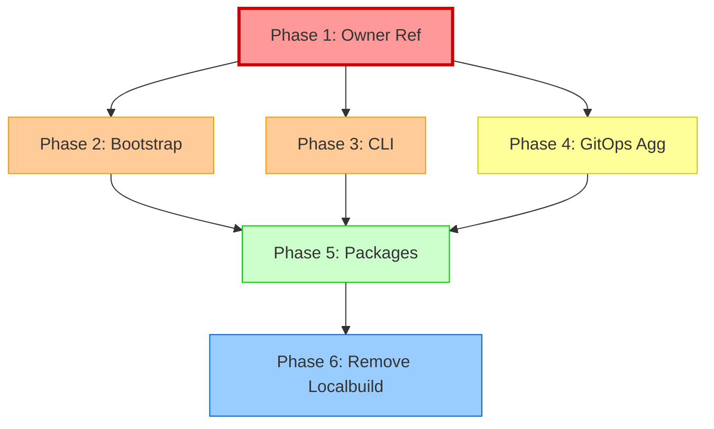

# Phased Implementation Plan for Controller-Based Architecture

**Version:** 1.0  
**Date:** January 7, 2026  
**Status:** Implementation Plan  
**Purpose:** Provide a phased implementation plan that allows for iterative testing of functionality as independent changes

## Executive Summary

This document analyzes the current state of implementation against the technical specifications and proposes a phased implementation plan that enables iterative testing and validation. Each phase represents an independently testable unit of functionality that builds upon previous phases.

## Current State Analysis

### What Has Been Implemented ✅

#### Phase 1.1: GiteaProvider (COMPLETE)
- ✅ **GiteaProvider CRD** - Full spec and status definition
- ✅ **GiteaProviderReconciler** - Basic installation logic
- ✅ **Git Provider Duck-Typing** - Utilities for provider independence
- ✅ **Controller Registration** - Integrated into controller manager
- ✅ **Unit Tests** - Basic reconciliation tests

**Reference**: `docs/implementation/phase-1-2-final-status.md`

#### Phase 1.2: NginxGateway and Platform (COMPLETE)
- ✅ **NginxGateway CRD** - Full spec and status definition
- ✅ **NginxGatewayReconciler** - Migration from localbuild nginx logic
- ✅ **Gateway Provider Duck-Typing** - Utilities for provider independence
- ✅ **Platform CRD** - Full spec and status definition
- ✅ **PlatformReconciler** - Basic aggregation of Git and Gateway providers
- ✅ **Controller Registration** - All v1alpha2 controllers registered
- ✅ **Unit Tests** - Controller and duck-typing tests
- ✅ **Documentation** - Examples and README in `examples/v1alpha2/`

**Reference**: `docs/implementation/phase-1-2-final-status.md`

#### Phase 1.3: ArgoCDProvider (COMPLETE)
- ✅ **ArgoCDProvider CRD** - Full spec and status definition
- ✅ **ArgoCDProviderReconciler** - Basic installation logic
- ✅ **GitOps Provider Duck-Typing** - Utilities for provider independence
- ✅ **Controller Registration** - Integrated into controller manager

#### Partial CLI Integration (INCOMPLETE)
- ✅ **CLI creates GiteaProvider** - `createGiteaProvider()` implemented
- ✅ **CLI creates Platform** - `createPlatform()` implemented (partial)
- ❌ **CLI creates NginxGateway** - NOT implemented
- ❌ **CLI creates ArgoCDProvider** - NOT implemented
- ❌ **Platform references all providers** - Only Git providers referenced

#### Pluggable Packages (IMPLEMENTED)
- ✅ **GitRepository CRD** - Custom resource for repository management
- ✅ **GitRepository Controller** - Creates repos in Gitea
- ✅ **CustomPackage support** - Directories, files, URLs
- ✅ **ArgoCD integration** - Creates ArgoCD Applications

**Reference**: `docs/specs/pluggable-packages.md`

### What Is Missing ❌

Based on analysis of specifications vs. implementation:

#### Critical Missing: Owner Reference Pattern
**Specification**: `docs/specs/controller-architecture-spec.md` (lines 344-643)  
**Status**: NOT IMPLEMENTED

This is the **most critical missing piece** that enables:
- Providers waiting for Platform before reconciling
- Configuration discovery from Platform
- Proper resource lifecycle management
- Coordinated bootstrap sequence

**Required in:**
- PlatformReconciler - `ensureOwnerReference()` method
- GiteaProviderReconciler - Wait for owner ref, discover config
- NginxGatewayReconciler - Wait for owner ref, discover config
- ArgoCDProviderReconciler - Wait for owner ref, discover config

**Reference**: `docs/implementation/next-steps-remove-localbuild.md` (Priority 1)

#### Missing: Bootstrap Repository Creation
**Specification**: `docs/specs/controller-architecture-spec.md` (lines 560-577)  
**Status**: NOT IMPLEMENTED in Platform controller

Currently handled by Localbuild controller, needs migration to Platform:
- Create GitRepository CRs for bootstrap apps (argocd, gitea, nginx)
- Create ArgoCD Applications for bootstrap apps
- Use duck-typed git provider access

**Reference**: `docs/implementation/next-steps-remove-localbuild.md` (Priority 2)

#### Missing: Complete CLI Integration
**Specification**: `docs/specs/controller-architecture-spec.md` (lines 3862-3923)  
**Status**: PARTIALLY IMPLEMENTED

Missing functions in `pkg/build/build.go`:
- `createNginxGateway()` - Create NginxGateway CR
- `createArgoCDProvider()` - Create ArgoCDProvider CR
- Update `createPlatform()` to reference Gateway and GitOps providers

**Reference**: `docs/implementation/next-steps-remove-localbuild.md` (Priority 3)

#### Missing: Platform GitOps Aggregation
**Specification**: `docs/specs/controller-architecture-spec.md` (lines 530-543)  
**Status**: NOT IMPLEMENTED

Platform controller needs to aggregate GitOps provider status:
- `aggregateGitOpsProviders()` method
- Update Platform.Status.Providers.GitOpsProviders
- Update Ready condition based on all provider types

**Reference**: `docs/implementation/next-steps-remove-localbuild.md` (Step 7)

#### Missing: Localbuild Removal
**Specification**: `docs/specs/controller-architecture-spec.md` (lines 3162-3207)  
**Status**: NOT STARTED

Final migration step:
- Remove Localbuild CR creation from CLI
- Deprecate Localbuild controller
- Delete Localbuild controller code
- Update migration documentation

**Reference**: `docs/implementation/next-steps-remove-localbuild.md` (Priority 5-7)

### Not Yet Specified (Future Phases)

These are in the specifications but not yet prioritized for implementation:

#### Hyperscaler Providers
**Specification**: `docs/specs/hyperscaler-provider-spec.md`  
**Status**: SPECIFICATION ONLY

Cloud provider implementations:
- AWS: CodeCommit, ALB Controller, EKS Capabilities
- Azure: Azure Repos, App Gateway, Flux Azure
- GCP: Cloud Source Repos, GKE Gateway, Config Sync

**Note**: These are Phase 4+ in the controller architecture spec.

#### Alternative Open Source Providers
**Specification**: `docs/specs/controller-architecture-spec.md` (lines 2825-2874)  
**Status**: SPECIFICATION ONLY

Additional provider types:
- GitHub Provider (external)
- GitLab Provider (external or in-cluster)
- Envoy Gateway Provider
- Istio Gateway Provider
- Flux Provider (alternative to ArgoCD)

**Note**: These are Phase 3-5 in the controller architecture spec.

#### Advanced Features
**Specification**: `docs/specs/controller-architecture-spec.md` (lines 3076-3161)  
**Status**: SPECIFICATION ONLY

Production features:
- Multi-cluster support (vCluster, Cluster API)
- High availability configurations
- Monitoring and observability
- Security enhancements
- Package ecosystem

**Note**: These are Phase 6-8 in the controller architecture spec.

## Phased Implementation Plan

The following phases are designed to be independently testable with clear success criteria. Each phase builds upon previous phases and represents a complete, working increment of functionality.

### Phase 1: Owner Reference Pattern Implementation
**Duration**: 1 week  
**Priority**: CRITICAL - Foundation for all other work  
**Dependencies**: None (builds on completed Phase 1.1, 1.2, 1.3)

#### Objectives
Implement the owner reference pattern that enables providers to:
1. Wait for Platform to establish ownership before reconciling
2. Discover configuration from Platform
3. Properly manage resource lifecycle

#### Tasks

**Task 1.1: Platform Controller - Add Owner Reference Establishment**
- File: `pkg/controllers/platform/platform_controller.go`
- Add `ensureProviderOwnerReferences()` method
- Add `ensureOwnerReference()` helper method
- Call early in Reconcile() after Platform CR is fetched
- Add RBAC permissions to update all provider types

```go
//+kubebuilder:rbac:groups=idpbuilder.cnoe.io,resources=giteaproviders;nginxgateways;argocdproviders,verbs=update;patch
```

**Task 1.2: GiteaProvider Controller - Add Owner Reference Check**
- File: `pkg/controllers/gitprovider/giteaprovider_controller.go`
- Add owner reference check at start of Reconcile()
- Add "WaitingForPlatform" phase
- Add configuration discovery from Platform.Spec.Domain
- Add requeue logic (30 second interval)
- Update status conditions appropriately

**Task 1.3: NginxGateway Controller - Add Owner Reference Check**
- File: `pkg/controllers/gatewayprovider/nginxgateway_controller.go`
- Same pattern as Task 1.2
- Discover protocol from Platform.Spec.IngressConfig.TLSSecretRef

**Task 1.4: ArgoCDProvider Controller - Add Owner Reference Check**
- File: `pkg/controllers/gitopsprovider/argocdprovider_controller.go`
- Same pattern as Task 1.2
- Discover ingress class from Gateway provider via Platform

**Task 1.5: Add Helper Utilities**
- File: `pkg/util/provider/owner.go` (new file)
- Implement `GetPlatformOwnerReference(obj client.Object)`
- Implement `HasPlatformOwnerReference(obj client.Object)`

#### Testing Strategy

**Unit Tests:**
- [ ] Test `ensureOwnerReference()` adds owner ref when missing
- [ ] Test `ensureOwnerReference()` skips when already present
- [ ] Test `ensureOwnerReference()` handles not found errors
- [ ] Test provider wait-for-owner logic (WaitingForPlatform phase)
- [ ] Test provider configuration discovery from Platform
- [ ] Test provider transitions from WaitingForPlatform to Installing

**Integration Tests:**
- [ ] Create providers first, verify "WaitingForPlatform" phase
- [ ] Create Platform, verify owner refs added to providers
- [ ] Verify providers transition to reconciling after owner ref added
- [ ] Test with all three provider types (Git, Gateway, GitOps)

**E2E Tests:**
- [ ] Full workflow: Create providers → Create Platform → Verify Ready
- [ ] Test order independence (Platform created before providers)
- [ ] Verify configuration discovered correctly (domain, protocol, etc.)

#### Success Criteria
- [ ] All provider controllers check for owner reference
- [ ] Providers wait in "WaitingForPlatform" until Platform adds owner ref
- [ ] Platform controller adds owner references to all providers
- [ ] Providers discover configuration from Platform
- [ ] All unit tests pass
- [ ] Integration tests demonstrate correct sequencing
- [ ] E2E test shows full lifecycle working

#### Deliverables
- Updated Platform controller with owner reference logic
- Updated all provider controllers with wait logic
- New utility functions for owner reference management
- Unit tests for owner reference pattern
- Integration tests validating sequencing
- Documentation update in resource-creation-sequencing.md

---

### Phase 2: Bootstrap Repository Creation
**Duration**: 1 week  
**Priority**: HIGH - Enables GitOps workflow  
**Dependencies**: Phase 1 (Owner Reference Pattern)

#### Objectives
Move bootstrap repository creation from Localbuild controller to Platform controller:
1. Create GitRepository CRs for bootstrap apps
2. Create ArgoCD Applications for bootstrap apps
3. Use duck-typed git provider access

#### Tasks

**Task 2.1: Move Bootstrap Logic to Platform Controller**
- File: `pkg/controllers/platform/platform_controller.go`
- Add `createBootstrapRepositories()` method
- Move `reconcileGitRepo()` from localbuild controller
- Move `reconcileEmbeddedApp()` from localbuild controller
- Update to use duck-typed git provider access
- Call after all providers are Ready

**Task 2.2: Update to Use Duck-Typed Providers**
- Update bootstrap logic to fetch git provider via duck-typing
- Use `provider.GetGitProviderStatus()` for endpoint/credentials
- Remove direct dependencies on Gitea-specific logic

**Task 2.3: Create ArgoCD Applications**
- Add logic to create ArgoCD Application CRs
- Reference GitRepository CRs created in Task 2.1
- Set Platform as owner of Applications

**Task 2.4: Update GitRepository Controller**
- File: `pkg/controllers/gitrepository/controller.go`
- Verify compatibility with Platform-created repos
- Ensure duck-typed provider access works correctly

#### Testing Strategy

**Unit Tests:**
- [ ] Test `createBootstrapRepositories()` creates GitRepository CRs
- [ ] Test ArgoCD Application creation
- [ ] Test duck-typed git provider access
- [ ] Test bootstrap content from embedded FS

**Integration Tests:**
- [ ] Create Platform with providers → Verify GitRepository CRs created
- [ ] Verify GitRepository controller syncs to Gitea
- [ ] Verify ArgoCD Applications created and synced
- [ ] Test with different git providers (when available)

**E2E Tests:**
- [ ] Full workflow: Platform Ready → Bootstrap repos → ArgoCD sync
- [ ] Verify bootstrap apps deployed (argocd, gitea, nginx)
- [ ] Verify apps accessible via ingress

#### Success Criteria
- [ ] Platform creates GitRepository CRs for bootstrap apps
- [ ] Platform creates ArgoCD Applications for bootstrap apps
- [ ] Bootstrap content synced to in-cluster git server
- [ ] ArgoCD syncs bootstrap applications
- [ ] All bootstrap apps reach Ready state
- [ ] All unit tests pass
- [ ] Integration tests validate GitOps workflow
- [ ] E2E test shows complete bootstrap flow

#### Deliverables
- Updated Platform controller with bootstrap logic
- Migrated reconciliation methods from Localbuild
- Unit tests for bootstrap repository creation
- Integration tests for GitOps workflow
- E2E test validating full bootstrap
- Documentation update for bootstrap process

---

### Phase 3: Complete CLI Integration
**Duration**: 3-5 days  
**Priority**: HIGH - Enables full v1alpha2 workflow  
**Dependencies**: Phase 1 (Owner Reference Pattern)

#### Objectives
Update CLI to create all required CRs for v1alpha2 architecture:
1. Create NginxGateway CR
2. Create ArgoCDProvider CR
3. Update Platform CR to reference all providers

#### Tasks

**Task 3.1: Add NginxGateway CR Creation**
- File: `pkg/build/build.go`
- Implement `createNginxGateway()` function
- Map CLI config to NginxGateway spec
- Call in Run() before Platform creation

**Task 3.2: Add ArgoCDProvider CR Creation**
- File: `pkg/build/build.go`
- Implement `createArgoCDProvider()` function
- Map CLI config to ArgoCDProvider spec
- Call in Run() before Platform creation

**Task 3.3: Update Platform CR Creation**
- File: `pkg/build/build.go`
- Update `createPlatform()` to add Gateway providers
- Update `createPlatform()` to add GitOps providers
- Ensure all provider references are included

**Task 3.4: Update CLI Status Display**
- File: `pkg/build/build.go`
- Display NginxGateway status
- Display ArgoCDProvider status
- Display Platform aggregated status

#### Testing Strategy

**Unit Tests:**
- [ ] Test `createNginxGateway()` creates correct CR
- [ ] Test `createArgoCDProvider()` creates correct CR
- [ ] Test `createPlatform()` includes all provider references
- [ ] Test CLI config mapping to provider specs

**Integration Tests:**
- [ ] Run `idpbuilder create` in test cluster
- [ ] Verify all provider CRs created
- [ ] Verify Platform CR references all providers
- [ ] Verify all CRs reach Ready state

**E2E Tests:**
- [ ] Full `idpbuilder create` workflow
- [ ] Verify all components installed
- [ ] Verify services accessible
- [ ] Test with custom CLI flags

#### Success Criteria
- [ ] CLI creates NginxGateway CR
- [ ] CLI creates ArgoCDProvider CR
- [ ] Platform CR references all three provider types
- [ ] All providers reach Ready state
- [ ] Platform reaches Ready state
- [ ] CLI displays status correctly
- [ ] All tests pass
- [ ] Feature parity with v1alpha1 CLI behavior

#### Deliverables
- `createNginxGateway()` function
- `createArgoCDProvider()` function
- Updated `createPlatform()` function
- Updated CLI status display
- Unit tests for new functions
- Integration tests for CLI workflow
- E2E test for full create command
- User documentation update

---

### Phase 4: Platform GitOps Aggregation
**Duration**: 2-3 days  
**Priority**: MEDIUM - Completes Platform status  
**Dependencies**: Phase 1 (Owner Reference Pattern)

#### Objectives
Complete Platform status aggregation by adding GitOps provider support:
1. Implement `aggregateGitOpsProviders()` method
2. Update Platform status to include GitOps providers
3. Update Ready condition based on all provider types

#### Tasks

**Task 4.1: Add GitOps Provider Aggregation**
- File: `pkg/controllers/platform/platform_controller.go`
- Implement `aggregateGitOpsProviders()` method
- Call in Reconcile() after gateway aggregation
- Update allReady logic to include GitOps providers

**Task 4.2: Add RBAC Permissions**
- File: `pkg/controllers/platform/platform_controller.go`
- Add read permissions for ArgoCDProvider

```go
//+kubebuilder:rbac:groups=idpbuilder.cnoe.io,resources=argocdproviders,verbs=get;list;watch
```

**Task 4.3: Update Platform Status Structure**
- Verify Platform.Status.Providers.GitOpsProviders exists
- Ensure proper status summary population

#### Testing Strategy

**Unit Tests:**
- [ ] Test `aggregateGitOpsProviders()` with zero providers
- [ ] Test `aggregateGitOpsProviders()` with single provider
- [ ] Test `aggregateGitOpsProviders()` with multiple providers
- [ ] Test Platform Ready condition with mixed provider states
- [ ] Test duck-typed access to GitOps provider status

**Integration Tests:**
- [ ] Create Platform with all three provider types
- [ ] Verify Platform.Status includes all providers
- [ ] Verify Platform Ready only when all providers Ready
- [ ] Test with providers becoming Ready at different times

#### Success Criteria
- [ ] Platform aggregates GitOps provider status
- [ ] Platform.Status.Providers.GitOpsProviders populated
- [ ] Platform Ready condition accurate
- [ ] All unit tests pass
- [ ] Integration tests validate aggregation

#### Deliverables
- `aggregateGitOpsProviders()` method
- Updated RBAC permissions
- Unit tests for GitOps aggregation
- Integration tests for complete Platform status
- Documentation update

---

### Phase 5: Custom Package Migration
**Duration**: 1 week  
**Priority**: MEDIUM - Maintains existing functionality  
**Dependencies**: Phase 1 (Owner Reference Pattern), Phase 2 (Bootstrap)

#### Objectives
Migrate custom package handling from Localbuild controller to work with v1alpha2:
1. Decide on approach (Option A: Move to Platform, Option B: Enhance CustomPackage controller)
2. Update to use duck-typed providers
3. Maintain existing functionality (dirs, files, URLs)

#### Tasks

**Task 5.1: Decision Point - Choose Approach**
- Evaluate Option A (move to Platform controller)
- Evaluate Option B (enhance CustomPackage controller)
- Document decision rationale

**Task 5.2: Implement Chosen Approach**

**Option A: Move to Platform Controller**
- Move custom package reconciliation methods to Platform controller
- Update to use duck-typed provider access
- Call after bootstrap repositories are created

**Option B: Enhance CustomPackage Controller**
- Update CustomPackage controller to discover git provider from Platform
- Use duck-typed provider access
- Maintain priority handling

**Task 5.3: Update Package Priority Handling**
- Ensure package priority conflicts handled correctly
- Update to work with v1alpha2 resources

**Task 5.4: Migrate Embedded Package Support**
- Move embedded package handling if needed
- Update to work with bootstrap flow

#### Testing Strategy

**Unit Tests:**
- [ ] Test custom package directory handling
- [ ] Test custom package file handling
- [ ] Test custom package URL handling
- [ ] Test package priority logic
- [ ] Test duck-typed provider access

**Integration Tests:**
- [ ] Test with custom package directory
- [ ] Test with custom package file
- [ ] Test with custom package URL
- [ ] Test package priority conflicts
- [ ] Test with multiple packages

**E2E Tests:**
- [ ] Full workflow with custom packages
- [ ] Verify packages deployed via ArgoCD
- [ ] Verify package priority respected
- [ ] Test with different package types

#### Success Criteria
- [ ] Custom packages work with v1alpha2
- [ ] All package types supported (dir, file, URL)
- [ ] Package priority handling works
- [ ] Duck-typed provider access works
- [ ] All tests pass
- [ ] Feature parity with v1alpha1

#### Deliverables
- Decision document for approach
- Updated custom package logic
- Unit tests for custom packages
- Integration tests for package types
- E2E test with custom packages
- User documentation for custom packages

---

### Phase 6: Localbuild Removal
**Duration**: 1 week  
**Priority**: LOW - Cleanup after migration complete  
**Dependencies**: Phases 1-5 (All previous phases complete and tested)

#### Objectives
Complete migration by removing Localbuild controller:
1. Remove Localbuild CR creation from CLI
2. Deprecate Localbuild controller
3. Delete Localbuild controller code
4. Update documentation

#### Tasks

**Task 6.1: Remove Localbuild CR Creation**
- File: `pkg/build/build.go`
- Delete Localbuild CR creation code (lines 281-318)
- Update `isCompatible()` to use Platform CR
- Remove imports for v1alpha1.Localbuild

**Task 6.2: Remove Localbuild Controller Registration**
- File: `pkg/controllers/run.go`
- Remove LocalbuildReconciler registration
- Update controller setup comments

**Task 6.3: Add Deprecation Notice**
- File: `api/v1alpha1/localbuild_types.go`
- Add deprecation notice in comments
- Consider conversion webhook for migration period

**Task 6.4: Delete Localbuild Controller (After Migration Period)**
- Delete `pkg/controllers/localbuild/` directory
- Remove from controller manager
- Clean up imports

**Task 6.5: Update Documentation**
- Update user guide to use v1alpha2
- Create migration guide from v1alpha1
- Update API reference documentation
- Add deprecation notices

#### Testing Strategy

**Unit Tests:**
- [ ] Verify CLI works without Localbuild
- [ ] Verify Platform CR compatibility check
- [ ] Verify no Localbuild references remain

**Integration Tests:**
- [ ] Test `idpbuilder create` without Localbuild
- [ ] Verify all features work with v1alpha2 only
- [ ] Test upgrade path (v1alpha1 to v1alpha2)

**E2E Tests:**
- [ ] Full `idpbuilder create` workflow
- [ ] Verify all components installed
- [ ] Compare with v1alpha1 functionality
- [ ] Performance comparison

**Regression Tests:**
- [ ] All existing integration tests pass
- [ ] All existing E2E tests pass
- [ ] No feature regressions

#### Success Criteria
- [ ] CLI does not create Localbuild CR
- [ ] Localbuild controller removed from registration
- [ ] All features work without Localbuild
- [ ] All tests pass
- [ ] Documentation updated
- [ ] Migration guide complete
- [ ] Performance comparable or better

#### Deliverables
- Updated CLI without Localbuild creation
- Deprecation notices in v1alpha1
- Migration guide from v1alpha1 to v1alpha2
- Updated user documentation
- All controller tests passing
- Performance comparison report

---

## Testing Strategy Summary

### Test Pyramid

```
                    E2E Tests
                   (Full System)
                  /            \
                 /              \
            Integration Tests
         (Controller Interactions)
            /              \
           /                \
      Unit Tests         Unit Tests
   (Controller Logic)  (Utilities)
```

### Test Categories by Phase

**Phase 1: Owner Reference Pattern**
- Unit: 15+ tests (owner ref logic, wait logic, config discovery)
- Integration: 8+ tests (sequencing, lifecycle)
- E2E: 3+ tests (full workflow, order independence)

**Phase 2: Bootstrap Repository Creation**
- Unit: 10+ tests (bootstrap logic, duck-typing)
- Integration: 6+ tests (GitOps workflow)
- E2E: 2+ tests (full bootstrap flow)

**Phase 3: Complete CLI Integration**
- Unit: 8+ tests (CR creation, config mapping)
- Integration: 4+ tests (CLI workflow)
- E2E: 3+ tests (full create command)

**Phase 4: Platform GitOps Aggregation**
- Unit: 6+ tests (aggregation logic)
- Integration: 3+ tests (status aggregation)
- E2E: 1+ test (Platform status)

**Phase 5: Custom Package Migration**
- Unit: 10+ tests (package handling)
- Integration: 5+ tests (package types)
- E2E: 3+ tests (full workflow)

**Phase 6: Localbuild Removal**
- Unit: 5+ tests (CLI logic)
- Integration: 3+ tests (upgrade path)
- E2E: 2+ tests (full workflow)
- Regression: All existing tests

### Continuous Testing

Each phase should:
1. Add tests before implementation (TDD)
2. Run tests continuously during development
3. Achieve >80% code coverage for new code
4. Pass all existing tests (no regressions)
5. Add E2E tests for user-facing changes

### Testing Tools

- **Unit Tests**: Go testing framework with fake clients
- **Integration Tests**: envtest (Kubernetes test environment)
- **E2E Tests**: Kind cluster + idpbuilder CLI
- **Performance**: Benchmarking against v1alpha1

## Risk Management

### Critical Risks

| Risk | Impact | Probability | Mitigation |
|------|--------|-------------|------------|
| Owner reference pattern breaks existing flow | High | Medium | Keep Localbuild controller until Phase 6 |
| Performance regression | Medium | Low | Benchmark each phase, optimize before merge |
| Missing functionality | High | Low | Comprehensive feature parity checklist |
| Complex migration path | Medium | Medium | Detailed step-by-step plan with rollback |

### Rollback Plans

**Phase 1-5**: Keep Localbuild controller active
- Can fall back to v1alpha1 path if issues arise
- No breaking changes until Phase 6

**Phase 6**: After Localbuild removal
- Revert CLI changes
- Re-register Localbuild controller
- Restore controller code from git
- Document issues and retry

## Timeline and Resource Estimates

### Overall Timeline
- **Total Duration**: 5-6 weeks for Phases 1-6
- **Parallel Work**: Phases can partially overlap
- **Buffer**: 1-2 weeks for unexpected issues

### Phase Timeline

```
Week 1: Phase 1 (Owner Reference Pattern)
Week 2: Phase 2 (Bootstrap) + Phase 3 (CLI) start
Week 3: Phase 3 (CLI) complete + Phase 4 (GitOps Agg)
Week 4: Phase 5 (Custom Packages)
Week 5: Phase 6 (Localbuild Removal)
Week 6: Final testing, documentation, release
```

### Resource Requirements
- **Developer Time**: 1-2 developers full-time
- **Testing Infrastructure**: Kind cluster, CI/CD pipeline
- **Code Review**: Technical lead review for each phase

## Success Metrics

### Phase-Level Metrics
- [ ] All unit tests pass (>80% coverage)
- [ ] All integration tests pass
- [ ] All E2E tests pass
- [ ] No performance regression
- [ ] Documentation complete
- [ ] Code review approved

### Overall Success Metrics
- [ ] v1alpha2 architecture fully functional
- [ ] All Localbuild functionality migrated
- [ ] Localbuild controller removed
- [ ] User migration guide complete
- [ ] Performance comparable or better
- [ ] All tests passing
- [ ] Production-ready quality

## Future Phases (Not in Current Plan)

### Phase 7: Alternative Open Source Providers
- GitHub Provider
- GitLab Provider
- Envoy Gateway Provider
- Istio Gateway Provider
- Flux Provider

### Phase 8: Hyperscaler Providers
- AWS Providers (CodeCommit, ALB, EKS Capabilities)
- Azure Providers (Azure Repos, App Gateway, Flux Azure)
- GCP Providers (Cloud Source Repos, GKE Gateway, Config Sync)

### Phase 9: Production Features
- Multi-cluster support
- High availability
- Monitoring and observability
- Security enhancements
- Package ecosystem

## References

### Technical Specifications
- [Controller Architecture Specification](../specs/controller-architecture-spec.md)
- [Hyperscaler Provider Specification](../specs/hyperscaler-provider-spec.md)
- [Pluggable Packages Specification](../specs/pluggable-packages.md)

### Implementation Documentation
- [Phase 1-2 Final Status](./phase-1-2-final-status.md)
- [Architecture Transition Guide](./architecture-transition.md)
- [Next Steps Remove Localbuild](./next-steps-remove-localbuild.md)
- [Resource Creation Sequencing](./resource-creation-sequencing.md)

### Examples
- [v1alpha2 Examples](../../examples/v1alpha2/)

## Appendix A: Implementation Status Matrix

| Component | Spec Section | Status | Phase |
|-----------|--------------|--------|-------|
| **Core CRDs** |
| GiteaProvider | controller-arch:1826-894 | ✅ Complete | 1.1 |
| NginxGateway | controller-arch:1046-1119 | ✅ Complete | 1.2 |
| ArgoCDProvider | controller-arch:1360-1442 | ✅ Complete | 1.3 |
| Platform | controller-arch:711-799 | ✅ Complete | 1.2 |
| **Controllers** |
| GiteaProviderReconciler | controller-arch:1826-894 | ✅ Complete | 1.1 |
| NginxGatewayReconciler | controller-arch:1046-1119 | ✅ Complete | 1.2 |
| ArgoCDProviderReconciler | controller-arch:1360-1442 | ✅ Complete | 1.3 |
| PlatformReconciler | controller-arch:530-611 | 🚧 Partial | 1.2 |
| **Key Patterns** |
| Duck-Typing | controller-arch:212-343 | ✅ Complete | 1.1-1.3 |
| Owner Reference | controller-arch:344-643 | ❌ Missing | **Phase 1** |
| Config Discovery | controller-arch:398-470 | ❌ Missing | **Phase 1** |
| **Platform Features** |
| Provider Aggregation | controller-arch:530-543 | 🚧 Partial | 1.2 |
| Bootstrap Repos | controller-arch:560-577 | ❌ Missing | **Phase 2** |
| GitOps Integration | controller-arch:765-772 | ❌ Missing | **Phase 2** |
| **CLI Integration** |
| Create GiteaProvider | controller-arch:3875-3884 | ✅ Complete | 1.1 |
| Create NginxGateway | controller-arch:3885-3890 | ❌ Missing | **Phase 3** |
| Create ArgoCDProvider | controller-arch:3891-3900 | ❌ Missing | **Phase 3** |
| Create Platform | controller-arch:3901-3922 | 🚧 Partial | 1.2 |
| **Package Support** |
| GitRepository CR | pluggable:70-73 | ✅ Complete | - |
| CustomPackage | pluggable:88-96 | ✅ Complete | - |
| Migration to v1alpha2 | - | ❌ Missing | **Phase 5** |
| **Migration** |
| Remove Localbuild CR | next-steps:299-317 | ❌ Missing | **Phase 6** |
| Remove Controller | next-steps:321-335 | ❌ Missing | **Phase 6** |
| Migration Guide | controller-arch:3162-3207 | ❌ Missing | **Phase 6** |

**Legend:**
- ✅ Complete - Implemented and tested
- 🚧 Partial - Partially implemented
- ❌ Missing - Not yet implemented

## Appendix B: Test Coverage Targets

| Phase | Unit Tests | Integration Tests | E2E Tests | Coverage Target |
|-------|-----------|-------------------|-----------|-----------------|
| Phase 1 | 15+ | 8+ | 3+ | >80% |
| Phase 2 | 10+ | 6+ | 2+ | >80% |
| Phase 3 | 8+ | 4+ | 3+ | >75% |
| Phase 4 | 6+ | 3+ | 1+ | >80% |
| Phase 5 | 10+ | 5+ | 3+ | >75% |
| Phase 6 | 5+ | 3+ | 2+ | >80% |
| **Total** | **54+** | **29+** | **14+** | **>78%** |

## Appendix C: Dependencies Graph



**Critical Path:** Phase 1 → Phase 2 → Phase 5 → Phase 6

**Parallel Tracks:** Phase 3 and Phase 4 can proceed in parallel with Phase 2

---

**Document Version History:**
- v1.0 (2026-01-07): Initial phased implementation plan
