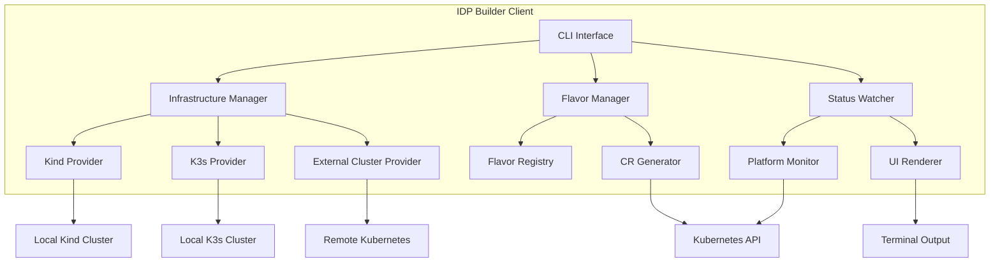

# Client Architecture Specification

**Status:** Proposal  
**Version:** 1.0 Draft  
**Date:** December 23, 2024  
**Author:** IDP Builder Team

## Executive Summary

This specification proposes a new unified **client architecture** for idpbuilder that replaces the current localbuilder implementation and existing CLI with a more modular, extensible design. The new client will provide three primary sets of functionality:

1. **Infrastructure Management** - Spins up underlying infrastructure for local development (e.g., statically linking with kind for local Kubernetes clusters)
2. **Flavor Selection** - Allows selection of an idpbuilder "flavor" - pre-defined sets of Custom Resources (CRs) that deploy a complete IDP instance on Kubernetes
3. **Status Monitoring** - Watches Platform resources and provides user-friendly status information during deployment and operation

This architecture aligns with the controller-based architecture detailed in [controller-architecture-spec.md](./controller-architecture-spec.md) and builds upon the resource tracking patterns described in [resource-creation-sequencing.md](./resource-creation-sequencing.md).

## Goals

### Primary Goals

1. **Separation of Concerns**: Clear separation between infrastructure provisioning, platform configuration, and status monitoring
2. **Modular Design**: Each client component is independently testable and replaceable
3. **Flavor Extensibility**: Easy to define new platform flavors without code changes
4. **Excellent UX**: Provide clear, real-time feedback to users during all operations
5. **Development/Production Parity**: Same client works for both local development and production deployments

### Non-Goals

- Building a general-purpose Kubernetes installer (we focus on IDP-specific use cases)
- Supporting non-Kubernetes deployment targets
- Managing infrastructure beyond what's needed for IDP deployment

## Architecture Overview

### High-Level Design



### Component Responsibilities

#### 1. Infrastructure Manager

**Purpose**: Provisions and manages the underlying Kubernetes infrastructure.

**Responsibilities**:
- Create local Kubernetes clusters (kind, k3s, etc.)
- Connect to existing/remote Kubernetes clusters
- Install core dependencies (CRDs, controllers)
- Configure networking (CoreDNS, ingress)
- Set up TLS certificates
- Manage cluster lifecycle

**Interfaces**:
```go
type InfrastructureManager interface {
    // Provision creates or connects to Kubernetes infrastructure
    Provision(ctx context.Context, config InfraConfig) (*InfraResult, error)
    
    // Teardown cleans up infrastructure resources
    Teardown(ctx context.Context) error
    
    // GetKubeConfig returns kubeconfig for the provisioned infrastructure
    GetKubeConfig() (*rest.Config, error)
    
    // Status returns current infrastructure status
    Status(ctx context.Context) (*InfraStatus, error)
}

type InfraProvider interface {
    // Name returns the provider name (e.g., "kind", "k3s")
    Name() string
    
    // CreateCluster creates a new cluster
    CreateCluster(ctx context.Context, config ClusterConfig) error
    
    // DeleteCluster deletes the cluster
    DeleteCluster(ctx context.Context, name string) error
    
    // ClusterExists checks if cluster exists
    ClusterExists(ctx context.Context, name string) (bool, error)
}
```

**Example Usage**:
```go
// Create infrastructure manager with kind provider
infraMgr := infrastructure.NewManager(
    infrastructure.WithProvider(kind.NewProvider()),
    infrastructure.WithClusterName("my-idp"),
)

// Provision infrastructure
result, err := infraMgr.Provision(ctx, infrastructure.Config{
    KubernetesVersion: "1.28.0",
    Networking: infrastructure.NetworkConfig{
        ServiceCIDR: "10.96.0.0/16",
        PodCIDR:     "10.244.0.0/16",
    },
})
```

#### 2. Flavor Manager

**Purpose**: Manages idpbuilder "flavors" - pre-defined platform configurations.

**Responsibilities**:
- Load flavor definitions from files or embedded resources
- Validate flavor configurations
- Generate appropriate Custom Resources for the selected flavor
- Support flavor composition (extending base flavors)
- Handle flavor-specific configuration overrides

**Flavor Definition Format**:
```yaml
# flavors/basic-dev.yaml
apiVersion: idpbuilder.cnoe.io/v1alpha1
kind: Flavor
metadata:
  name: basic-dev
  description: Basic development environment with Gitea, Nginx, and ArgoCD
spec:
  # Components to install
  components:
    gitProvider:
      kind: GiteaProvider
      version: "1.21.0"
      config:
        adminAutoGenerate: true
        
    gateway:
      kind: NginxGateway
      version: "1.13.0"
      config:
        ingressClass: nginx
        
    gitOpsProvider:
      kind: ArgoCDProvider
      version: "v2.12.0"
      config:
        adminAutoGenerate: true
        ssoEnabled: false
        
  # Platform configuration
  platform:
    domain: "cnoe.localtest.me"
    tls:
      enabled: true
      selfSigned: true
      
  # Custom packages to include
  customPackages:
    - name: backstage
      source: https://github.com/cnoe-io/backstage-app
      
    - name: crossplane
      source: https://github.com/cnoe-io/crossplane-configs
```

**Interfaces**:
```go
type FlavorManager interface {
    // ListFlavors returns all available flavors
    ListFlavors() ([]FlavorInfo, error)
    
    // GetFlavor loads a specific flavor definition
    GetFlavor(name string) (*Flavor, error)
    
    // GenerateResources generates CRs for the given flavor
    GenerateResources(flavor *Flavor, overrides map[string]interface{}) ([]client.Object, error)
    
    // ValidateFlavor validates a flavor definition
    ValidateFlavor(flavor *Flavor) error
}

type FlavorRegistry interface {
    // RegisterFlavor adds a flavor to the registry
    RegisterFlavor(flavor *Flavor) error
    
    // GetFlavor retrieves a flavor by name
    GetFlavor(name string) (*Flavor, error)
    
    // ListFlavors returns all registered flavors
    ListFlavors() ([]FlavorInfo, error)
}
```

**Built-in Flavors**:

1. **`basic-dev`**: Minimal setup for local development
   - Gitea (Git provider)
   - Nginx (Gateway)
   - ArgoCD (GitOps)
   
2. **`full-dev`**: Complete development environment
   - All basic-dev components
   - Backstage (Developer portal)
   - Crossplane (Infrastructure as Code)
   - Vault (Secrets management)
   
3. **`production-aws`**: Production-ready on AWS EKS
   - GitHub provider (using GitHub App)
   - AWS ALB Ingress Controller
   - ArgoCD with SSO
   - External Secrets Operator
   
4. **`production-azure`**: Production-ready on Azure AKS
   - Azure DevOps Repos
   - Azure Application Gateway
   - Flux with Azure integration
   
5. **`minimal`**: Absolute minimum for testing
   - Gitea only
   - No gateway
   - No GitOps provider

**Example Usage**:
```go
// Load a flavor
flavorMgr := flavor.NewManager(
    flavor.WithBuiltInFlavors(),
    flavor.WithCustomFlavorPath("./my-flavors"),
)

flavor, err := flavorMgr.GetFlavor("basic-dev")

// Generate resources with overrides
overrides := map[string]interface{}{
    "platform.domain": "my-company.dev",
    "gitProvider.config.adminPassword": "secret123",
}

resources, err := flavorMgr.GenerateResources(flavor, overrides)

// Apply to cluster
for _, resource := range resources {
    err := kubeClient.Create(ctx, resource)
}
```

#### 3. Status Watcher

**Purpose**: Monitors Platform and Provider resources and displays status to users.

**Responsibilities**:
- Watch Platform CR for status changes
- Monitor Provider CRs (Git, Gateway, GitOps)
- Display real-time progress in terminal
- Show detailed error messages and troubleshooting hints
- Support different output formats (human-readable, JSON, etc.)

**Interfaces**:
```go
type StatusWatcher interface {
    // Watch monitors the platform and reports status
    Watch(ctx context.Context, platformName string) error
    
    // WaitForReady blocks until platform is ready or timeout
    WaitForReady(ctx context.Context, platformName string, timeout time.Duration) error
    
    // GetStatus returns current platform status
    GetStatus(ctx context.Context, platformName string) (*PlatformStatus, error)
}

type UIRenderer interface {
    // RenderProgress displays progress information
    RenderProgress(status *PlatformStatus)
    
    // RenderError displays error information
    RenderError(err error)
    
    // RenderCompletion displays completion message
    RenderCompletion(status *PlatformStatus)
}
```

**Display Modes**:

1. **Interactive Mode** (default for TTY):
   ```
   ┌─ IDP Platform: my-idp ─────────────────────────────────┐
   │ Status: Initializing                                    │
   │ Domain: cnoe.localtest.me                              │
   │                                                         │
   │ Components:                                             │
   │  ✓ Gitea          Ready    (2m34s)                     │
   │  ✓ Nginx Gateway  Ready    (1m12s)                     │
   │  ⟳ ArgoCD         Installing... 45%                    │
   │                                                         │
   │ Recent Events:                                          │
   │  • ArgoCD deployment scaling up (replicas: 1/2)        │
   │  • ArgoCD API server initializing                      │
   └─────────────────────────────────────────────────────────┘
   ```

2. **Simple Mode** (non-TTY):
   ```
   [INFO] Platform: my-idp
   [INFO] Status: Initializing
   [OK] Gitea: Ready (2m34s)
   [OK] Nginx Gateway: Ready (1m12s)
   [PROGRESS] ArgoCD: Installing (45%)
   ```

3. **JSON Mode**:
   ```json
   {
     "platform": "my-idp",
     "status": "Initializing",
     "components": [
       {"name": "gitea", "kind": "GiteaProvider", "ready": true, "elapsed": "2m34s"},
       {"name": "nginx", "kind": "NginxGateway", "ready": true, "elapsed": "1m12s"},
       {"name": "argocd", "kind": "ArgoCDProvider", "ready": false, "progress": 45}
     ]
   }
   ```

**Example Usage**:
```go
// Create status watcher
watcher := status.NewWatcher(kubeClient,
    status.WithRenderer(status.NewInteractiveRenderer()),
    status.WithUpdateInterval(5 * time.Second),
)

// Watch platform status
err := watcher.Watch(ctx, "my-idp-platform")

// Or wait for ready with timeout
err := watcher.WaitForReady(ctx, "my-idp-platform", 10*time.Minute)
```

## Client Command Structure

### New CLI Command Hierarchy

```
idpbuilder
├── create              Create a new IDP instance
│   ├── --flavor        Flavor to use (default: basic-dev)
│   ├── --name          Name of the IDP instance
│   ├── --infra         Infrastructure provider (kind, k3s, external)
│   ├── --kubeconfig    Path to kubeconfig (for external)
│   └── --set           Override flavor values (key=value)
│
├── delete              Delete an IDP instance
│   ├── --name          Name of the IDP instance
│   └── --keep-infra    Keep infrastructure (don't delete cluster)
│
├── get                 Get information about IDP instances
│   ├── platforms       List all platforms
│   ├── providers       List all providers
│   ├── flavors         List available flavors
│   └── status          Get detailed status of a platform
│       └── --name      Platform name
│
├── apply               Apply a flavor to existing infrastructure
│   ├── --flavor        Flavor to apply
│   ├── --kubeconfig    Path to kubeconfig
│   └── --set           Override flavor values
│
├── watch               Watch platform status (real-time monitoring)
│   ├── --name          Platform name
│   └── --output        Output format (interactive, simple, json)
│
└── version             Display version information
```

### Command Examples

**Create with default flavor**:
```bash
idpbuilder create --name my-idp
# Uses: flavor=basic-dev, infra=kind
```

**Create with specific flavor and overrides**:
```bash
idpbuilder create \
  --name my-idp \
  --flavor full-dev \
  --set platform.domain=my-company.dev \
  --set gitProvider.config.adminPassword=secret123
```

**Create on existing cluster**:
```bash
idpbuilder create \
  --name my-idp \
  --flavor production-aws \
  --infra external \
  --kubeconfig ~/.kube/my-eks-cluster
```

**Watch platform status**:
```bash
idpbuilder watch --name my-idp
# Or during creation:
idpbuilder create --name my-idp --watch
```

**List available flavors**:
```bash
idpbuilder get flavors
# Output:
# NAME            DESCRIPTION                                    COMPONENTS
# basic-dev       Basic development environment                  gitea, nginx, argocd
# full-dev        Complete development environment               gitea, nginx, argocd, backstage, crossplane
# production-aws  Production-ready on AWS EKS                    github, alb, argocd
# minimal         Minimal setup for testing                      gitea
```

**Get platform status**:
```bash
idpbuilder get status --name my-idp
# Output:
# Platform: my-idp
# Status: Ready
# Domain: cnoe.localtest.me
# 
# Components:
#   Gitea (GiteaProvider)         Ready    https://gitea.cnoe.localtest.me
#   Nginx (NginxGateway)          Ready    
#   ArgoCD (ArgoCDProvider)       Ready    https://argocd.cnoe.localtest.me
```

**Delete platform**:
```bash
# Delete platform and infrastructure
idpbuilder delete --name my-idp

# Delete platform but keep cluster
idpbuilder delete --name my-idp --keep-infra
```

## Implementation Plan

### Phase 1: Infrastructure Manager (Week 1-2)

**Objectives**:
- Extract infrastructure provisioning logic from current `pkg/build`
- Create pluggable provider interface
- Implement kind provider (refactor existing code)
- Add support for external cluster provider

**Deliverables**:
- [ ] `pkg/client/infrastructure` package
- [ ] `InfrastructureManager` interface and implementation
- [ ] `InfraProvider` interface
- [ ] `KindProvider` implementation
- [ ] `ExternalProvider` implementation
- [ ] Unit tests for infrastructure components
- [ ] Integration tests for cluster creation

**Success Criteria**:
- Can create/delete kind clusters programmatically
- Can connect to external clusters with kubeconfig
- Infrastructure manager is independently testable
- Maintains feature parity with current implementation

### Phase 2: Flavor Manager (Week 3-4)

**Objectives**:
- Design flavor definition format
- Implement flavor registry and loader
- Create built-in flavor definitions
- Implement CR generation from flavors

**Deliverables**:
- [ ] `pkg/client/flavor` package
- [ ] Flavor CRD and types
- [ ] `FlavorManager` implementation
- [ ] Built-in flavors (basic-dev, full-dev, minimal)
- [ ] CR generator with override support
- [ ] Flavor validation logic
- [ ] Unit tests for flavor processing
- [ ] Documentation for creating custom flavors

**Success Criteria**:
- Can load and validate flavor definitions
- Can generate correct CRs from flavors
- Can apply overrides to flavor values
- Built-in flavors work correctly

### Phase 3: Status Watcher (Week 5)

**Objectives**:
- Implement Platform/Provider status monitoring
- Create UI renderers for different output modes
- Integrate with existing status reporter

**Deliverables**:
- [ ] `pkg/client/status` package (refactor existing)
- [ ] `StatusWatcher` implementation
- [ ] Interactive renderer with progress tracking
- [ ] Simple renderer for non-TTY
- [ ] JSON renderer for scripting
- [ ] Real-time status updates via watches
- [ ] Error reporting with troubleshooting hints

**Success Criteria**:
- Displays real-time platform status
- Shows progress for all components
- Handles long-running operations gracefully
- Provides clear error messages

### Phase 4: CLI Integration (Week 6)

**Objectives**:
- Refactor CLI commands to use new client components
- Implement new command structure
- Maintain backward compatibility where possible

**Deliverables**:
- [ ] Refactored `pkg/cmd/create` using new client
- [ ] New `pkg/cmd/apply` command
- [ ] Enhanced `pkg/cmd/get` command
- [ ] New `pkg/cmd/watch` command
- [ ] Updated help text and examples
- [ ] Migration guide for users

**Success Criteria**:
- All CLI commands work with new architecture
- User experience is improved or maintained
- Breaking changes are documented
- Migration path is clear

### Phase 5: Testing and Documentation (Week 7-8)

**Objectives**:
- Comprehensive testing of all components
- Complete documentation
- Performance optimization

**Deliverables**:
- [ ] E2E tests for complete workflows
- [ ] Performance benchmarks
- [ ] User documentation
- [ ] Developer documentation
- [ ] Migration guide
- [ ] Tutorial for creating custom flavors

**Success Criteria**:
- >80% test coverage for new components
- All E2E scenarios pass
- Documentation is complete and clear
- Performance meets or exceeds current implementation

### Phase 6: Deprecation and Cleanup (Week 9-10)

**Objectives**:
- Deprecate old localbuilder implementation
- Remove deprecated code after migration period
- Final polish and optimization

**Deliverables**:
- [ ] Deprecation notices in old code
- [ ] Removal of `pkg/build` (after migration)
- [ ] Removal of localbuilder controller dependencies in CLI
- [ ] Performance optimizations
- [ ] Final documentation updates

**Success Criteria**:
- Old implementation is fully deprecated
- No breaking changes for users who migrate
- Clean, maintainable codebase

## Migration Strategy

### For Users

**Current workflow**:
```bash
idpbuilder create --name my-idp
```

**New workflow** (same command, new implementation):
```bash
idpbuilder create --name my-idp
# Now uses flavor=basic-dev by default
```

**Advanced usage** (new capabilities):
```bash
idpbuilder create --name my-idp --flavor full-dev
```

### For Developers

**Before**: Tightly coupled CLI and build logic
```go
// pkg/cmd/create/create.go
build := build.NewBuild(cfg)
build.Run(ctx)
```

**After**: Modular client components
```go
// pkg/cmd/create/create.go
infraMgr := infrastructure.NewManager(...)
flavorMgr := flavor.NewManager(...)
statusWatcher := status.NewWatcher(...)

// Provision infrastructure
result, err := infraMgr.Provision(ctx, infraConfig)

// Apply flavor
resources, err := flavorMgr.GenerateResources(selectedFlavor, overrides)
for _, res := range resources {
    kubeClient.Create(ctx, res)
}

// Watch status
statusWatcher.WaitForReady(ctx, platformName, timeout)
```

### Backward Compatibility

1. **Phase 1-5**: Both old and new implementations coexist
2. **Phase 6**: Add deprecation warnings to old implementation
3. **Future release**: Remove old implementation after migration period

## Security Considerations

1. **Credentials Management**:
   - Never log sensitive configuration values
   - Use Kubernetes secrets for credentials
   - Support external secret management (Vault, etc.)

2. **Network Security**:
   - TLS by default for all exposed services
   - Support for custom CA certificates
   - Network policies for inter-component communication

3. **RBAC**:
   - Minimal permissions for client operations
   - Support for assuming different roles
   - Audit logging of client actions

## Performance Considerations

1. **Concurrent Operations**:
   - Parallel CR creation where possible
   - Efficient watch/poll mechanisms
   - Resource pooling for API clients

2. **Resource Usage**:
   - Minimal memory footprint
   - Efficient handling of large flavor definitions
   - Streaming output for long-running operations

## Testing Strategy

### Unit Tests
- All public interfaces have unit tests
- Mock infrastructure providers for testing
- Flavor validation and CR generation logic
- Status parsing and rendering logic

### Integration Tests
- Real cluster creation/deletion (kind)
- CR generation and application
- Status watching with real Platform CRs
- Complete workflows end-to-end

### E2E Tests
- Full `create` → `watch` → `delete` workflow
- Multiple flavors
- Override handling
- Error scenarios and recovery

## Documentation Requirements

### User Documentation
1. **Getting Started Guide**: Using the new CLI
2. **Flavor Guide**: Understanding and selecting flavors
3. **Custom Flavor Tutorial**: Creating custom flavors
4. **Advanced Configuration**: Overrides and customization
5. **Troubleshooting Guide**: Common issues and solutions

### Developer Documentation
1. **Architecture Overview**: High-level design
2. **Component API Reference**: Detailed interface documentation
3. **Provider Development Guide**: Creating new infrastructure providers
4. **Flavor Development Guide**: Creating new flavors
5. **Contributing Guide**: How to contribute to the client

## Success Metrics

1. **User Experience**:
   - Time to first successful deployment < 5 minutes
   - Clear error messages with actionable guidance
   - >90% user satisfaction in surveys

2. **Code Quality**:
   - >80% test coverage
   - Zero critical security vulnerabilities
   - <100ms command startup time

3. **Functionality**:
   - Support for 5+ built-in flavors
   - Easy custom flavor creation
   - Real-time status updates

## Related Documentation

- [Controller Architecture Spec](./controller-architecture-spec.md) - Controller design
- [Resource Creation Sequencing](./resource-creation-sequencing.md) - Resource tracking
- [Next Steps to Remove Localbuild](../implementation/next-steps-remove-localbuild.md) - Current migration plan

## Appendix A: Flavor Schema

```yaml
apiVersion: idpbuilder.cnoe.io/v1alpha1
kind: Flavor
metadata:
  name: string              # Unique flavor name
  description: string       # Human-readable description
  labels:
    environment: string     # e.g., "development", "production"
    complexity: string      # e.g., "minimal", "basic", "full"

spec:
  # Base flavor to extend (optional)
  extends: string
  
  # Component definitions
  components:
    gitProvider:
      kind: string          # e.g., GiteaProvider, GitHubProvider
      version: string
      config: {}            # Provider-specific configuration
      
    gateway:
      kind: string          # e.g., NginxGateway, IstioGateway
      version: string
      config: {}
      
    gitOpsProvider:
      kind: string          # e.g., ArgoCDProvider, FluxProvider
      version: string
      config: {}
      
    # Additional providers (optional)
    additionalProviders:
      - kind: string
        version: string
        config: {}
        
  # Platform configuration
  platform:
    domain: string
    namespace: string
    tls:
      enabled: bool
      selfSigned: bool
      certManager: bool
      
  # Custom packages
  customPackages:
    - name: string
      source: string        # URL or path
      priority: int         # Installation order
      config: {}            # Package-specific config
      
  # Infrastructure hints (for validation)
  infrastructure:
    minimumNodes: int
    minimumMemory: string   # e.g., "4Gi"
    minimumCPU: string      # e.g., "2"
```

## Appendix B: Example Flavors

### Minimal Flavor
```yaml
apiVersion: idpbuilder.cnoe.io/v1alpha1
kind: Flavor
metadata:
  name: minimal
  description: Minimal setup with just Git provider
  labels:
    environment: development
    complexity: minimal
spec:
  components:
    gitProvider:
      kind: GiteaProvider
      version: "1.21.0"
      config:
        adminAutoGenerate: true
  platform:
    domain: "cnoe.localtest.me"
    tls:
      enabled: false
```

### Full Development Flavor
```yaml
apiVersion: idpbuilder.cnoe.io/v1alpha1
kind: Flavor
metadata:
  name: full-dev
  description: Complete development environment
  labels:
    environment: development
    complexity: full
spec:
  extends: basic-dev
  
  customPackages:
    - name: backstage
      source: https://github.com/cnoe-io/backstage-app
      priority: 100
      
    - name: crossplane
      source: https://github.com/cnoe-io/crossplane-configs
      priority: 200
      
    - name: vault
      source: https://github.com/cnoe-io/vault-config
      priority: 150
      config:
        mode: dev
        unsealed: true
```

### Production AWS Flavor
```yaml
apiVersion: idpbuilder.cnoe.io/v1alpha1
kind: Flavor
metadata:
  name: production-aws
  description: Production-ready on AWS EKS
  labels:
    environment: production
    cloud: aws
spec:
  components:
    gitProvider:
      kind: GitHubProvider
      version: "latest"
      config:
        appAuth: true
        
    gateway:
      kind: ALBIngressController
      version: "v2.6.0"
      config:
        aws:
          region: us-west-2
          
    gitOpsProvider:
      kind: ArgoCDProvider
      version: "v2.12.0"
      config:
        sso:
          enabled: true
          provider: okta
        ha:
          enabled: true
          
  platform:
    domain: "idp.example.com"
    tls:
      enabled: true
      certManager: true
      issuer: letsencrypt-prod
      
  customPackages:
    - name: external-secrets
      source: https://github.com/cnoe-io/external-secrets-aws
      config:
        provider: aws
        
  infrastructure:
    minimumNodes: 3
    minimumMemory: "16Gi"
    minimumCPU: "4"
```
