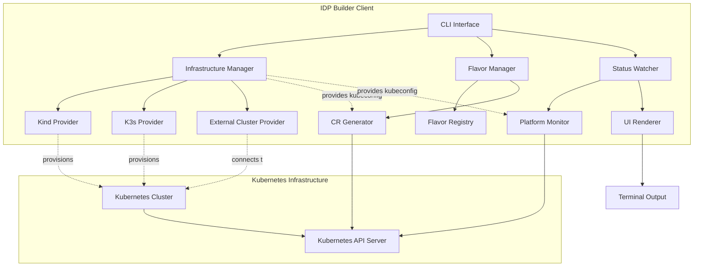

# Client Architecture Specification

**Status:** Proposal  
**Version:** 1.0 Draft  
**Date:** December 23, 2024  
**Author:** IDP Builder Team

## Executive Summary

This specification proposes a new unified **client architecture** for idpbuilder that replaces the current localbuilder implementation and existing CLI with a more modular, extensible design. The new client will provide three primary sets of functionality:

1. **Infrastructure Management** - Spins up underlying infrastructure for local development (e.g., statically linking with kind for local Kubernetes clusters)
2. **Flavor Selection** - Allows selection of an idpbuilder "flavor" - pre-defined sets of Custom Resources (CRs) that deploy a complete IDP instance on Kubernetes
3. **Status Monitoring** - Watches Platform resources and provides user-friendly status information during deployment and operation

This architecture aligns with the controller-based architecture detailed in [controller-architecture-spec.md](./controller-architecture-spec.md) and builds upon the resource tracking patterns described in [resource-creation-sequencing.md](./resource-creation-sequencing.md).

## Goals

### Primary Goals

1. **Separation of Concerns**: Clear separation between infrastructure provisioning, platform configuration, and status monitoring
2. **Modular Design**: Each client component is independently testable and replaceable
3. **Flavor Extensibility**: Easy to define new platform flavors without code changes
4. **Excellent UX**: Provide clear, real-time feedback to users during all operations
5. **Development/Production Parity**: Same client works for both local development and production deployments

### Non-Goals

- Building a general-purpose Kubernetes installer (we focus on IDP-specific use cases)
- Supporting non-Kubernetes deployment targets
- Managing infrastructure beyond what's needed for IDP deployment

## Architecture Overview

### High-Level Design



### Component Interaction Flow

The architecture follows a clear separation where the Infrastructure Manager provisions the Kubernetes cluster and provides access credentials to other components:

1. **Infrastructure Manager** provisions or connects to a Kubernetes cluster
2. **Infrastructure Manager** returns a `kubeconfig` via `GetKubeConfig()`
3. **Flavor Manager's CR Generator** uses the kubeconfig to create Custom Resources in the cluster
4. **Status Watcher's Platform Monitor** uses the kubeconfig to watch resources in the cluster
5. All Kubernetes API interactions go through the cluster provisioned by Infrastructure Manager

This design ensures:
- Single source of truth for cluster access (Infrastructure Manager)
- No ambiguity about which Kubernetes cluster is being used
- Clean dependency injection pattern
- Components can be tested independently with mock kubeconfigs

### Controller Installation and CRD Management

A critical aspect of the architecture is how controllers for provider resources (GiteaProvider, NginxGateway, ArgoCDProvider, etc.) are installed before their CRs are created.

**Infrastructure Manager Responsibilities:**

The Infrastructure Manager installs core IDP Builder controllers during cluster provisioning:

```go
type InfraConfig struct {
    KubernetesVersion string
    InstallControllers bool  // Default: true for local clusters
    ControllerVersion string  // Default: "latest"
}

// During Provision()
if config.InstallControllers {
    // Install CRDs and controllers
    err := installIDPBuilderControllers(ctx, kubeClient, config.ControllerVersion)
    // This installs:
    // - GiteaProvider CRD + controller
    // - NginxGateway CRD + controller
    // - ArgoCDProvider CRD + controller
    // - Platform CRD + controller
    // - PlatformInstallation CRD + controller
}
```

**Helm-Packaged Flavors:**

For Helm charts, controller installation is declared as a dependency:

```yaml
# Chart.yaml
apiVersion: v2
name: idpbuilder-basic-dev
version: 1.0.0

dependencies:
  # Core IDP Builder controllers (installs CRDs + controllers)
  - name: idpbuilder-controllers
    version: "^0.5.0"
    repository: "https://cnoe-io.github.io/idpbuilder"
    
  # Provider-specific controllers (optional, if not included in core)
  - name: nginx-ingress-controller
    version: "4.8.0"
    repository: "https://kubernetes.github.io/ingress-nginx"
    condition: gateway.installController
```

Helm automatically installs dependencies before the main chart, ensuring controllers are available before provider CRs are created.

**Kustomize-Packaged Flavors:**

For Kustomize, controller installation uses resource ordering or ArgoCD sync waves:

```yaml
# flavors/basic-dev/kustomization.yaml
apiVersion: kustomize.config.k8s.io/v1beta1
kind: Kustomization

resources:
  # Install controllers first
  - https://github.com/cnoe-io/idpbuilder/releases/v0.5.0/download/controllers.yaml
  
  # Then provider CRs (will wait for CRDs to be available)
  - gitea-provider.yaml
  - nginx-gateway.yaml
  - argocd-provider.yaml
  - platform.yaml
```

With ArgoCD sync waves for explicit ordering:

```yaml
# controllers.yaml
metadata:
  annotations:
    argocd.argoproj.io/sync-wave: "1"  # Install controllers first

---
# gitea-provider.yaml
metadata:
  annotations:
    argocd.argoproj.io/sync-wave: "2"  # Install providers after controllers
```

**Controller Discovery and Validation:**

The Flavor Manager validates that required controllers are available before creating CRs:

```go
type FlavorManager interface {
    // ValidateFlavor checks that required controllers are installed
    ValidateFlavor(ctx context.Context, flavor *Flavor, kubeClient client.Client) error
}

func (m *Manager) ValidateFlavor(ctx context.Context, flavor *Flavor, kubeClient client.Client) error {
    // Check that required CRDs exist
    for _, component := range flavor.Spec.Components {
        crdName := component.Kind + "s.idpbuilder.cnoe.io"
        if !crdExists(ctx, kubeClient, crdName) {
            return fmt.Errorf("required CRD %s not found, install controllers first", crdName)
        }
    }
    return nil
}
```

**Installation Sequence:**

1. **Infrastructure Manager** provisions cluster and installs core controllers (for local/managed clusters)
2. **Flavor packaging** (Helm/Kustomize) declares additional controller dependencies
3. **Package manager** (Helm/ArgoCD) installs controllers before provider CRs
4. **Flavor Manager** validates controllers are available
5. **CR Generator** creates provider CRs referencing the now-available controller types

This ensures controllers are always installed before the CRs that depend on them.

### Component Responsibilities

#### 1. Infrastructure Manager

**Purpose**: Provisions and manages the underlying Kubernetes infrastructure.

**Responsibilities**:
- Create local Kubernetes clusters (kind, k3s, etc.)
- Connect to existing/remote Kubernetes clusters
- Install core dependencies (CRDs, controllers)
- Configure networking (CoreDNS, ingress)
- Set up TLS certificates
- Manage cluster lifecycle

**Interfaces**:
```go
type InfrastructureManager interface {
    // Provision creates or connects to Kubernetes infrastructure
    Provision(ctx context.Context, config InfraConfig) (*InfraResult, error)
    
    // Teardown cleans up infrastructure resources
    Teardown(ctx context.Context) error
    
    // GetKubeConfig returns kubeconfig for the provisioned infrastructure
    GetKubeConfig() (*rest.Config, error)
    
    // Status returns current infrastructure status
    Status(ctx context.Context) (*InfraStatus, error)
}

type InfraProvider interface {
    // Name returns the provider name (e.g., "kind", "k3s")
    Name() string
    
    // CreateCluster creates a new cluster
    CreateCluster(ctx context.Context, config ClusterConfig) error
    
    // DeleteCluster deletes the cluster
    DeleteCluster(ctx context.Context, name string) error
    
    // ClusterExists checks if cluster exists
    ClusterExists(ctx context.Context, name string) (bool, error)
}
```

**Example Usage**:
```go
// Create infrastructure manager with kind provider
infraMgr := infrastructure.NewManager(
    infrastructure.WithProvider(kind.NewProvider()),
    infrastructure.WithClusterName("my-idp"),
)

// Provision infrastructure with controller installation
result, err := infraMgr.Provision(ctx, infrastructure.Config{
    KubernetesVersion: "1.28.0",
    InstallControllers: true,  // Install IDP Builder controllers
    ControllerVersion: "v0.5.0",
    Networking: infrastructure.NetworkConfig{
        ServiceCIDR: "10.96.0.0/16",
        PodCIDR:     "10.244.0.0/16",
    },
})

// Controllers are now installed and ready
// CRDs available: GiteaProvider, NginxGateway, ArgoCDProvider, Platform
```

#### 2. Flavor Manager

**Purpose**: Manages idpbuilder "flavors" - pre-defined platform configurations.

**Responsibilities**:
- Load flavor definitions from files or embedded resources
- Validate flavor configurations and controller availability
- Generate appropriate Custom Resources for the selected flavor
- Support flavor composition (extending base flavors)
- Handle flavor-specific configuration overrides
- Verify required CRDs are installed before generating provider CRs

**Flavor Definition Format**:
```yaml
# flavors/basic-dev.yaml
apiVersion: idpbuilder.cnoe.io/v1alpha1
kind: Flavor
metadata:
  name: basic-dev
  description: Basic development environment with Gitea, Nginx, and ArgoCD
spec:
  # Components to install
  components:
    gitProvider:
      kind: GiteaProvider
      version: "1.21.0"
      config:
        adminAutoGenerate: true
        
    gateway:
      kind: NginxGateway
      version: "1.13.0"
      config:
        ingressClass: nginx
        
    gitOpsProvider:
      kind: ArgoCDProvider
      version: "v2.12.0"
      config:
        adminAutoGenerate: true
        ssoEnabled: false
        
  # Platform configuration
  platform:
    domain: "cnoe.localtest.me"
    tls:
      enabled: true
      selfSigned: true
      
  # Custom packages to include
  customPackages:
    - name: backstage
      source: https://github.com/cnoe-io/backstage-app
      
    - name: crossplane
      source: https://github.com/cnoe-io/crossplane-configs
```

**Interfaces**:
```go
type FlavorManager interface {
    // ListFlavors returns all available flavors
    ListFlavors() ([]FlavorInfo, error)
    
    // GetFlavor loads a specific flavor definition
    GetFlavor(name string) (*Flavor, error)
    
    // GenerateResources generates CRs for the given flavor
    GenerateResources(flavor *Flavor, overrides map[string]interface{}) ([]client.Object, error)
    
    // ValidateFlavor validates a flavor definition and checks controller availability
    ValidateFlavor(ctx context.Context, flavor *Flavor, kubeClient client.Client) error
}

type FlavorRegistry interface {
    // RegisterFlavor adds a flavor to the registry
    RegisterFlavor(flavor *Flavor) error
    
    // GetFlavor retrieves a flavor by name
    GetFlavor(name string) (*Flavor, error)
    
    // ListFlavors returns all registered flavors
    ListFlavors() ([]FlavorInfo, error)
}
```

**Built-in Flavors**:

Built-in flavors are included with IDP Builder and do not depend on external cloud providers or third-party proprietary software:

1. **`minimal`**: Absolute minimum for testing
   - Gitea only (Git provider)
   - No gateway
   - No GitOps provider
   
2. **`basic-dev`**: Standard local development setup
   - Gitea (Git provider)
   - Nginx Ingress (Gateway)
   - ArgoCD (GitOps)

**Example Flavors**:

Additional flavors are provided as examples and can be customized for specific environments. These may depend on cloud providers or third-party services:

- **`full-dev`**: Extended development environment with Backstage, Crossplane, and Vault
- **`production-aws`**: AWS EKS optimized with GitHub, ALB, and production-grade configurations
- **`production-azure`**: Azure AKS optimized with Azure DevOps and Application Gateway
- **`production-gcp`**: GCP GKE optimized with Cloud Source Repos and GKE Gateway

See [Appendix B: Example Flavors](#appendix-b-example-flavors) for complete definitions.

**Example Usage**:
```go
// 1. Provision infrastructure first
infraMgr := infrastructure.NewManager(
    infrastructure.WithProvider(kind.NewProvider()),
    infrastructure.WithClusterName("my-idp"),
)
result, err := infraMgr.Provision(ctx, infrastructure.Config{
    KubernetesVersion: "1.28.0",
})

// 2. Get kubeconfig from infrastructure manager
kubeConfig, err := infraMgr.GetKubeConfig()
kubeClient, err := client.New(kubeConfig, client.Options{})

// 3. Load a flavor
flavorMgr := flavor.NewManager(
    flavor.WithBuiltInFlavors(),
    flavor.WithCustomFlavorPath("./my-flavors"),
)

flavor, err := flavorMgr.GetFlavor("basic-dev")

// 4. Validate that required controllers are installed
err = flavorMgr.ValidateFlavor(ctx, flavor, kubeClient)
if err != nil {
    // Controllers not available, need to install them first
    return fmt.Errorf("flavor validation failed: %w", err)
}

// 5. Generate resources with overrides
overrides := map[string]interface{}{
    "platform.domain": "my-company.dev",
    "gitProvider.config.adminPassword": "secret123",
}

resources, err := flavorMgr.GenerateResources(flavor, overrides)

// 6. Apply to cluster using kubeconfig from infrastructure manager
for _, resource := range resources {
    err := kubeClient.Create(ctx, resource)
}
```

### Flavor Packaging, Distribution, and Consumption

Flavors leverage standard Kubernetes packaging systems rather than creating custom mechanisms. This section describes how flavors are packaged, distributed, and consumed.

#### Packaging Formats

**Option 1: Helm Charts (Recommended)**

Flavors are packaged as Helm charts with pre-configured values files:

```
idpbuilder-flavor-basic-dev/
├── Chart.yaml           # Helm chart metadata with dependencies
├── values.yaml          # Default values
├── values-examples/     # Example configurations
│   ├── dev.yaml
│   └── staging.yaml
└── templates/
    ├── platform.yaml    # Platform CR template
    ├── gitea.yaml       # GiteaProvider CR template
    ├── nginx.yaml       # NginxGateway CR template
    └── argocd.yaml      # ArgoCDProvider CR template
```

Chart.yaml with controller dependencies:
```yaml
apiVersion: v2
name: idpbuilder-basic-dev
description: Basic development environment flavor for IDP Builder
version: 1.0.0
appVersion: "1.0"

dependencies:
  # Controllers needed for providers
  - name: idpbuilder-controllers
    version: "0.5.0"
    repository: "https://cnoe-io.github.io/idpbuilder"
    condition: controllers.install
    
  # Optional: Pre-install provider-specific controllers
  - name: gitea-operator
    version: "1.21.0"
    repository: "https://dl.gitea.io/charts"
    condition: gitProvider.operator.install
```

**Option 2: Kustomize Overlays**

Flavors as Kustomize directory structures:

```
flavors/
├── base/
│   ├── kustomization.yaml
│   ├── platform.yaml
│   └── namespace.yaml
├── basic-dev/
│   ├── kustomization.yaml      # References base + patches
│   ├── gitea-provider.yaml
│   ├── nginx-gateway.yaml
│   ├── argocd-provider.yaml
│   └── patches/
│       └── platform-domain.yaml
└── production-aws/
    ├── kustomization.yaml
    ├── github-provider.yaml
    └── patches/
        ├── platform-tls.yaml
        └── argocd-ha.yaml
```

kustomization.yaml example:
```yaml
apiVersion: kustomize.config.k8s.io/v1beta1
kind: Kustomization

namespace: idpbuilder-system

# Install controllers first (via Helm or manifests)
resources:
  - https://github.com/cnoe-io/idpbuilder/releases/latest/download/controllers.yaml
  - ../../base
  - gitea-provider.yaml
  - nginx-gateway.yaml
  - argocd-provider.yaml

patches:
  - path: patches/platform-domain.yaml
    target:
      kind: Platform
```

**Option 3: OCI Artifacts**

Package flavors as OCI artifacts for container registry distribution:

```bash
# Package flavor as OCI artifact
helm package flavors/basic-dev
helm push idpbuilder-basic-dev-1.0.0.tgz oci://ghcr.io/cnoe-io/flavors

# Consume from OCI registry
helm install my-idp oci://ghcr.io/cnoe-io/flavors/idpbuilder-basic-dev --version 1.0.0
```

#### Distribution Channels

**1. Official Flavor Repository**

Central catalog of example flavors and community contributions:

```
https://github.com/cnoe-io/idpbuilder-flavors/
├── minimal/             # Built-in (also embedded in CLI)
├── basic-dev/           # Built-in (also embedded in CLI)
├── full-dev/            # Example flavor
├── production-aws/      # Example flavor
├── production-azure/    # Example flavor
├── production-gcp/      # Example flavor
└── index.yaml           # Helm repository index
```

Note: Built-in flavors (minimal, basic-dev) are embedded in the IDP Builder CLI and don't require external repositories for basic usage.

**2. Helm Chart Repository**

```bash
# Add repository
helm repo add idpbuilder https://cnoe-io.github.io/idpbuilder-flavors
helm repo update

# Search available flavors
helm search repo idpbuilder

# Install flavor
helm install my-idp idpbuilder/basic-dev
```

**3. OCI Registry**

```bash
# List available flavors
helm search repo oci://ghcr.io/cnoe-io/flavors

# Pull flavor locally
helm pull oci://ghcr.io/cnoe-io/flavors/idpbuilder-basic-dev --version 1.0.0

# Install from OCI
helm install my-idp oci://ghcr.io/cnoe-io/flavors/idpbuilder-basic-dev
```

**4. Git Repositories**

```bash
# Kustomize from Git
kubectl apply -k https://github.com/cnoe-io/idpbuilder-flavors//basic-dev

# ArgoCD Application
apiVersion: argoproj.io/v1alpha1
kind: Application
metadata:
  name: idpbuilder
spec:
  source:
    repoURL: https://github.com/cnoe-io/idpbuilder-flavors
    path: basic-dev
    targetRevision: main
```

#### Controller Dependencies

Flavors declare controller dependencies that must be installed before provider CRs can be reconciled.

**Dependency Declaration in Helm**

```yaml
# Chart.yaml
dependencies:
  # Core IDP Builder controllers (always required)
  - name: idpbuilder-controllers
    version: "^0.5.0"
    repository: "https://cnoe-io.github.io/idpbuilder"
    
  # Provider-specific controllers (conditional)
  - name: nginx-ingress-controller
    version: "4.8.0"
    repository: "https://kubernetes.github.io/ingress-nginx"
    condition: gateway.kind=NginxGateway
    
  - name: argocd
    version: "5.51.0"
    repository: "https://argoproj.github.io/argo-helm"
    condition: gitOpsProvider.kind=ArgoCDProvider
```

**Installation Sequence with Helm Hooks**

```yaml
# templates/00-controllers.yaml
apiVersion: v1
kind: Namespace
metadata:
  name: idpbuilder-system
  annotations:
    "helm.sh/hook": pre-install
    "helm.sh/hook-weight": "-10"

---
# Install controllers before any CRs
apiVersion: v1
kind: ConfigMap
metadata:
  name: controller-installer
  annotations:
    "helm.sh/hook": pre-install
    "helm.sh/hook-weight": "-5"
    "helm.sh/hook-delete-policy": before-hook-creation
data:
  install.sh: |
    #!/bin/bash
    # Install idpbuilder controllers
    kubectl apply -f https://github.com/cnoe-io/idpbuilder/releases/latest/download/controllers.yaml
    kubectl wait --for=condition=ready pod -l app=idpbuilder-controller -n idpbuilder-system --timeout=300s
```

**Installation Sequence with Kustomize**

```yaml
# kustomization.yaml
apiVersion: kustomize.config.k8s.io/v1beta1
kind: Kustomization

resources:
  # Phase 1: Controllers (with sync-wave annotations)
  - controllers/idpbuilder-controllers.yaml
  
  # Phase 2: Provider CRs (depend on controllers)
  - providers/gitea-provider.yaml
  - providers/nginx-gateway.yaml
  - providers/argocd-provider.yaml
  
  # Phase 3: Platform CR (depends on providers)
  - platform/platform.yaml

# ArgoCD sync waves for ordering
patches:
  - target:
      kind: CustomResourceDefinition
    patch: |-
      - op: add
        path: /metadata/annotations/argocd.argoproj.io~1sync-wave
        value: "1"
  
  - target:
      kind: Deployment
      namespace: idpbuilder-system
    patch: |-
      - op: add
        path: /metadata/annotations/argocd.argoproj.io~1sync-wave
        value: "2"
        
  - target:
      group: idpbuilder.cnoe.io
      kind: GiteaProvider
    patch: |-
      - op: add
        path: /metadata/annotations/argocd.argoproj.io~1sync-wave
        value: "3"
```

#### Consumption Patterns

**1. CLI-Driven (Development)**

```bash
# Using Helm
idpbuilder create --flavor helm://idpbuilder/basic-dev --set domain=dev.local

# Using Kustomize
idpbuilder create --flavor kustomize://github.com/cnoe-io/idpbuilder-flavors//basic-dev

# Using OCI
idpbuilder create --flavor oci://ghcr.io/cnoe-io/flavors/basic-dev:1.0.0
```

Internally, CLI:
1. Fetches flavor package
2. Resolves and installs controller dependencies
3. Applies provider and platform CRs
4. Monitors installation progress

**2. GitOps-Driven (Production)**

ArgoCD Application:
```yaml
apiVersion: argoproj.io/v1alpha1
kind: Application
metadata:
  name: idpbuilder-platform
  namespace: argocd
spec:
  project: default
  
  source:
    # Helm chart flavor
    chart: idpbuilder-basic-dev
    repoURL: https://cnoe-io.github.io/idpbuilder-flavors
    targetRevision: 1.0.0
    helm:
      values: |
        domain: production.company.com
        platform:
          tls:
            enabled: true
            certManager: true
  
  destination:
    server: https://kubernetes.default.svc
    namespace: idpbuilder-system
  
  syncPolicy:
    automated:
      prune: true
      selfHeal: true
    syncOptions:
      - CreateNamespace=true
    retry:
      limit: 5
      backoff:
        duration: 5s
        factor: 2
        maxDuration: 3m
```

Flux Kustomization:
```yaml
apiVersion: kustomize.toolkit.fluxcd.io/v1
kind: Kustomization
metadata:
  name: idpbuilder-platform
  namespace: flux-system
spec:
  interval: 10m
  path: ./flavors/basic-dev
  prune: true
  sourceRef:
    kind: GitRepository
    name: idpbuilder-flavors
  healthChecks:
    - apiVersion: idpbuilder.cnoe.io/v1alpha1
      kind: Platform
      name: my-platform
      namespace: idpbuilder-system
```

**3. Direct Kubernetes Apply**

```bash
# Helm
helm install my-idp idpbuilder/basic-dev \
  --namespace idpbuilder-system \
  --create-namespace \
  --set domain=my-company.dev \
  --wait --timeout 10m

# Kustomize
kubectl apply -k https://github.com/cnoe-io/idpbuilder-flavors//basic-dev

# OCI
helm install my-idp oci://ghcr.io/cnoe-io/flavors/idpbuilder-basic-dev \
  --version 1.0.0 \
  --namespace idpbuilder-system \
  --create-namespace
```

#### Flavor Versioning and Compatibility

**Semantic Versioning**

```yaml
# Chart.yaml
version: 1.2.3  # Flavor version
appVersion: "0.5.0"  # IDP Builder version compatibility

# Version constraints
dependencies:
  - name: idpbuilder-controllers
    version: "^0.5.0"  # Compatible with 0.5.x
```

**Compatibility Matrix**

```yaml
# flavor-metadata.yaml
apiVersion: idpbuilder.cnoe.io/v1alpha1
kind: FlavorMetadata
metadata:
  name: basic-dev
spec:
  version: 1.2.3
  compatibility:
    idpbuilderVersion: ">=0.5.0,<0.7.0"
    kubernetesVersion: ">=1.26.0"
    
  dependencies:
    controllers:
      - name: idpbuilder-controllers
        version: "0.5.0"
        required: true
      - name: nginx-ingress-controller
        version: "4.8.0"
        required: false
        condition: gateway.kind=NginxGateway
```

#### Custom Flavor Creation

Users can create custom flavors by:

**1. Fork and Customize**

```bash
# Clone flavor repository
git clone https://github.com/cnoe-io/idpbuilder-flavors
cd idpbuilder-flavors

# Copy and customize
cp -r basic-dev my-custom-flavor
cd my-custom-flavor

# Edit Chart.yaml, values.yaml, templates
vi values.yaml

# Package and distribute
helm package .
helm push my-custom-flavor-1.0.0.tgz oci://myregistry.io/flavors
```

**2. Compose from Existing**

```yaml
# Chart.yaml - extend basic-dev
apiVersion: v2
name: my-company-dev
version: 1.0.0

dependencies:
  - name: idpbuilder-basic-dev
    version: "1.0.0"
    repository: "https://cnoe-io.github.io/idpbuilder-flavors"
  
  # Add company-specific components
  - name: company-monitoring
    version: "2.1.0"
    repository: "https://charts.company.com"
```

**3. Create from Scratch**

```bash
# Initialize new Helm chart
helm create my-flavor

# Add IDP Builder templates
cat > templates/platform.yaml <<EOF
apiVersion: idpbuilder.cnoe.io/v1alpha1
kind: Platform
metadata:
  name: {{ .Release.Name }}
spec:
  domain: {{ .Values.domain }}
  # ... rest of configuration
EOF

# Define dependencies in Chart.yaml
# Package and distribute
```

#### Flavor Discovery and Registry

**Helm Repository Index**

```yaml
# index.yaml
apiVersion: v1
entries:
  idpbuilder-minimal:
    - name: idpbuilder-minimal
      version: 1.0.0
      description: Minimal setup with just Git provider (built-in)
      urls:
        - https://cnoe-io.github.io/idpbuilder-flavors/minimal-1.0.0.tgz
      annotations:
        type: built-in
        
  idpbuilder-basic-dev:
    - name: idpbuilder-basic-dev
      version: 1.0.0
      description: Standard local development setup (built-in)
      urls:
        - https://cnoe-io.github.io/idpbuilder-flavors/basic-dev-1.0.0.tgz
      annotations:
        type: built-in
      
  idpbuilder-full-dev:
    - name: idpbuilder-full-dev
      version: 1.0.0
      description: Extended development environment (example)
      urls:
        - https://cnoe-io.github.io/idpbuilder-flavors/full-dev-1.0.0.tgz
      annotations:
        type: example
        
  idpbuilder-production-aws:
    - name: idpbuilder-production-aws
      version: 1.0.0
      description: Production-ready on AWS EKS (example)
      urls:
        - https://cnoe-io.github.io/idpbuilder-flavors/production-aws-1.0.0.tgz
      annotations:
        type: example
        cloud: aws
```

**Flavor Catalog API**

```bash
# List available flavors
idpbuilder flavor list

# Search flavors
idpbuilder flavor search --keyword production --cloud aws

# Show flavor details
idpbuilder flavor show basic-dev

# Update flavor catalog
idpbuilder flavor update
```

#### 3. Status Watcher

**Purpose**: Monitors Platform and Provider resources and displays status to users.

**Responsibilities**:
- Watch Platform CR for status changes
- Monitor Provider CRs (Git, Gateway, GitOps)
- Display real-time progress in terminal
- Show detailed error messages and troubleshooting hints
- Support different output formats (human-readable, JSON, etc.)

**Interfaces**:
```go
type StatusWatcher interface {
    // Watch monitors the platform and reports status
    Watch(ctx context.Context, platformName string) error
    
    // WaitForReady blocks until platform is ready or timeout
    WaitForReady(ctx context.Context, platformName string, timeout time.Duration) error
    
    // GetStatus returns current platform status
    GetStatus(ctx context.Context, platformName string) (*PlatformStatus, error)
}

type UIRenderer interface {
    // RenderProgress displays progress information
    RenderProgress(status *PlatformStatus)
    
    // RenderError displays error information
    RenderError(err error)
    
    // RenderCompletion displays completion message
    RenderCompletion(status *PlatformStatus)
}
```

**Display Modes**:

1. **Interactive Mode** (default for TTY):
   ```
   ┌─ IDP Platform: my-idp ─────────────────────────────────┐
   │ Status: Initializing                                    │
   │ Domain: cnoe.localtest.me                              │
   │                                                         │
   │ Components:                                             │
   │  ✓ Gitea          Ready    (2m34s)                     │
   │  ✓ Nginx Gateway  Ready    (1m12s)                     │
   │  ⟳ ArgoCD         Installing... 45%                    │
   │                                                         │
   │ Recent Events:                                          │
   │  • ArgoCD deployment scaling up (replicas: 1/2)        │
   │  • ArgoCD API server initializing                      │
   └─────────────────────────────────────────────────────────┘
   ```

2. **Simple Mode** (non-TTY):
   ```
   [INFO] Platform: my-idp
   [INFO] Status: Initializing
   [OK] Gitea: Ready (2m34s)
   [OK] Nginx Gateway: Ready (1m12s)
   [PROGRESS] ArgoCD: Installing (45%)
   ```

3. **JSON Mode**:
   ```json
   {
     "platform": "my-idp",
     "status": "Initializing",
     "components": [
       {"name": "gitea", "kind": "GiteaProvider", "ready": true, "elapsed": "2m34s"},
       {"name": "nginx", "kind": "NginxGateway", "ready": true, "elapsed": "1m12s"},
       {"name": "argocd", "kind": "ArgoCDProvider", "ready": false, "progress": 45}
     ]
   }
   ```

**Example Usage**:
```go
// Get kubeconfig from infrastructure manager
kubeConfig, err := infraMgr.GetKubeConfig()
kubeClient, err := client.New(kubeConfig, client.Options{})

// Create status watcher with kubeClient from infrastructure
watcher := status.NewWatcher(kubeClient,
    status.WithRenderer(status.NewInteractiveRenderer()),
    status.WithUpdateInterval(5 * time.Second),
)

// Watch platform status
err := watcher.Watch(ctx, "my-idp-platform")

// Or wait for ready with timeout
err := watcher.WaitForReady(ctx, "my-idp-platform", 10*time.Minute)
```

## Client Command Structure

### New CLI Command Hierarchy

```
idpbuilder
├── create              Create a new IDP instance
│   ├── --flavor        Flavor to use (default: basic-dev)
│   ├── --name          Name of the IDP instance
│   ├── --infra         Infrastructure provider (kind, k3s, external)
│   ├── --kubeconfig    Path to kubeconfig (for external)
│   └── --set           Override flavor values (key=value)
│
├── delete              Delete an IDP instance
│   ├── --name          Name of the IDP instance
│   └── --keep-infra    Keep infrastructure (don't delete cluster)
│
├── get                 Get information about IDP instances
│   ├── platforms       List all platforms
│   ├── providers       List all providers
│   ├── flavors         List available flavors
│   └── status          Get detailed status of a platform
│       └── --name      Platform name
│
├── apply               Apply a flavor to existing infrastructure
│   ├── --flavor        Flavor to apply
│   ├── --kubeconfig    Path to kubeconfig
│   └── --set           Override flavor values
│
├── watch               Watch platform status (real-time monitoring)
│   ├── --name          Platform name
│   └── --output        Output format (interactive, simple, json)
│
└── version             Display version information
```

### Command Examples

**Create with default flavor**:
```bash
idpbuilder create --name my-idp
# Uses: flavor=basic-dev, infra=kind
```

**Create with specific flavor and overrides**:
```bash
idpbuilder create \
  --name my-idp \
  --flavor full-dev \
  --set platform.domain=my-company.dev \
  --set gitProvider.config.adminPassword=secret123
```

**Create on existing cluster**:
```bash
idpbuilder create \
  --name my-idp \
  --flavor production-aws \
  --infra external \
  --kubeconfig ~/.kube/my-eks-cluster
```

**Watch platform status**:
```bash
idpbuilder watch --name my-idp
# Or during creation:
idpbuilder create --name my-idp --watch
```

**List available flavors**:
```bash
idpbuilder get flavors
# Output:
# NAME            DESCRIPTION                                    COMPONENTS
# NAME            DESCRIPTION                                    COMPONENTS                    TYPE
# minimal         Minimal setup for testing                      gitea                         built-in
# basic-dev       Standard local development setup               gitea, nginx, argocd          built-in
# full-dev        Extended development environment               gitea, nginx, argocd, +3      example
# production-aws  Production-ready on AWS EKS                    github, alb, argocd           example
# production-azure Production-ready on Azure AKS                 azurerepos, appgw, flux       example
# production-gcp  Production-ready on GCP GKE                    cloudrepos, gke-gw, argocd    example
```

**Get platform status**:
```bash
idpbuilder get status --name my-idp
# Output:
# Platform: my-idp
# Status: Ready
# Domain: cnoe.localtest.me
# 
# Components:
#   Gitea (GiteaProvider)         Ready    https://gitea.cnoe.localtest.me
#   Nginx (NginxGateway)          Ready    
#   ArgoCD (ArgoCDProvider)       Ready    https://argocd.cnoe.localtest.me
```

**Delete platform**:
```bash
# Delete platform and infrastructure
idpbuilder delete --name my-idp

# Delete platform but keep cluster
idpbuilder delete --name my-idp --keep-infra
```

## Implementation Plan

### Phase 1: Infrastructure Manager (Week 1-2)

**Objectives**:
- Extract infrastructure provisioning logic from current `pkg/build`
- Create pluggable provider interface
- Implement kind provider (refactor existing code)
- Add support for external cluster provider

**Deliverables**:
- [ ] `pkg/client/infrastructure` package
- [ ] `InfrastructureManager` interface and implementation
- [ ] `InfraProvider` interface
- [ ] `KindProvider` implementation
- [ ] `ExternalProvider` implementation
- [ ] Unit tests for infrastructure components
- [ ] Integration tests for cluster creation

**Success Criteria**:
- Can create/delete kind clusters programmatically
- Can connect to external clusters with kubeconfig
- Infrastructure manager is independently testable
- Maintains feature parity with current implementation

### Phase 2: Flavor Manager (Week 3-4)

**Objectives**:
- Design flavor definition format
- Implement flavor registry and loader
- Create built-in flavor definitions
- Implement CR generation from flavors

**Deliverables**:
- [ ] `pkg/client/flavor` package
- [ ] Flavor CRD and types
- [ ] `FlavorManager` implementation
- [ ] Built-in flavors (minimal, basic-dev)
- [ ] Example flavors (full-dev, production-aws, production-azure, production-gcp)
- [ ] CR generator with override support
- [ ] Flavor validation logic
- [ ] Unit tests for flavor processing
- [ ] Documentation for creating custom flavors

**Success Criteria**:
- Can load and validate flavor definitions
- Can generate correct CRs from flavors
- Can apply overrides to flavor values
- Built-in flavors work correctly

### Phase 3: Status Watcher (Week 5)

**Objectives**:
- Implement Platform/Provider status monitoring
- Create UI renderers for different output modes
- Integrate with existing status reporter

**Deliverables**:
- [ ] `pkg/client/status` package (refactor existing)
- [ ] `StatusWatcher` implementation
- [ ] Interactive renderer with progress tracking
- [ ] Simple renderer for non-TTY
- [ ] JSON renderer for scripting
- [ ] Real-time status updates via watches
- [ ] Error reporting with troubleshooting hints

**Success Criteria**:
- Displays real-time platform status
- Shows progress for all components
- Handles long-running operations gracefully
- Provides clear error messages

### Phase 4: CLI Integration (Week 6)

**Objectives**:
- Refactor CLI commands to use new client components
- Implement new command structure
- Maintain backward compatibility where possible

**Deliverables**:
- [ ] Refactored `pkg/cmd/create` using new client
- [ ] New `pkg/cmd/apply` command
- [ ] Enhanced `pkg/cmd/get` command
- [ ] New `pkg/cmd/watch` command
- [ ] Updated help text and examples
- [ ] Migration guide for users

**Success Criteria**:
- All CLI commands work with new architecture
- User experience is improved or maintained
- Breaking changes are documented
- Migration path is clear

### Phase 5: Testing and Documentation (Week 7-8)

**Objectives**:
- Comprehensive testing of all components
- Complete documentation
- Performance optimization

**Deliverables**:
- [ ] E2E tests for complete workflows
- [ ] Performance benchmarks
- [ ] User documentation
- [ ] Developer documentation
- [ ] Migration guide
- [ ] Tutorial for creating custom flavors

**Success Criteria**:
- >80% test coverage for new components
- All E2E scenarios pass
- Documentation is complete and clear
- Performance meets or exceeds current implementation

### Phase 6: Deprecation and Cleanup (Week 9-10)

**Objectives**:
- Deprecate old localbuilder implementation
- Remove deprecated code after migration period
- Final polish and optimization

**Deliverables**:
- [ ] Deprecation notices in old code
- [ ] Removal of `pkg/build` (after migration)
- [ ] Removal of localbuilder controller dependencies in CLI
- [ ] Performance optimizations
- [ ] Final documentation updates

**Success Criteria**:
- Old implementation is fully deprecated
- No breaking changes for users who migrate
- Clean, maintainable codebase

## Migration Strategy

### For Users

**Current workflow**:
```bash
idpbuilder create --name my-idp
```

**New workflow** (same command, new implementation):
```bash
idpbuilder create --name my-idp
# Now uses flavor=basic-dev by default
```

**Advanced usage** (new capabilities):
```bash
idpbuilder create --name my-idp --flavor full-dev
```

### For Developers

**Before**: Tightly coupled CLI and build logic
```go
// pkg/cmd/create/create.go
build := build.NewBuild(cfg)
build.Run(ctx)
```

**After**: Modular client components
```go
// pkg/cmd/create/create.go
infraMgr := infrastructure.NewManager(...)
flavorMgr := flavor.NewManager(...)
statusWatcher := status.NewWatcher(...)

// Provision infrastructure
result, err := infraMgr.Provision(ctx, infraConfig)

// Apply flavor
resources, err := flavorMgr.GenerateResources(selectedFlavor, overrides)
for _, res := range resources {
    kubeClient.Create(ctx, res)
}

// Watch status
statusWatcher.WaitForReady(ctx, platformName, timeout)
```

### Backward Compatibility

1. **Phase 1-5**: Both old and new implementations coexist
2. **Phase 6**: Add deprecation warnings to old implementation
3. **Future release**: Remove old implementation after migration period

## Security Considerations

1. **Credentials Management**:
   - Never log sensitive configuration values
   - Use Kubernetes secrets for credentials
   - Support external secret management (Vault, etc.)

2. **Network Security**:
   - TLS by default for all exposed services
   - Support for custom CA certificates
   - Network policies for inter-component communication

3. **RBAC**:
   - Minimal permissions for client operations
   - Support for assuming different roles
   - Audit logging of client actions

## Performance Considerations

1. **Concurrent Operations**:
   - Parallel CR creation where possible
   - Efficient watch/poll mechanisms
   - Resource pooling for API clients

2. **Resource Usage**:
   - Minimal memory footprint
   - Efficient handling of large flavor definitions
   - Streaming output for long-running operations

## Testing Strategy

### Unit Tests
- All public interfaces have unit tests
- Mock infrastructure providers for testing
- Flavor validation and CR generation logic
- Status parsing and rendering logic

### Integration Tests
- Real cluster creation/deletion (kind)
- CR generation and application
- Status watching with real Platform CRs
- Complete workflows end-to-end

### E2E Tests
- Full `create` → `watch` → `delete` workflow
- Multiple flavors
- Override handling
- Error scenarios and recovery

## Documentation Requirements

### User Documentation
1. **Getting Started Guide**: Using the new CLI
2. **Flavor Guide**: Understanding and selecting flavors
3. **Custom Flavor Tutorial**: Creating custom flavors
4. **Advanced Configuration**: Overrides and customization
5. **Troubleshooting Guide**: Common issues and solutions

### Developer Documentation
1. **Architecture Overview**: High-level design
2. **Component API Reference**: Detailed interface documentation
3. **Provider Development Guide**: Creating new infrastructure providers
4. **Flavor Development Guide**: Creating new flavors
5. **Contributing Guide**: How to contribute to the client

## Success Metrics

1. **User Experience**:
   - Time to first successful deployment < 5 minutes
   - Clear error messages with actionable guidance
   - >90% user satisfaction in surveys

2. **Code Quality**:
   - >80% test coverage
   - Zero critical security vulnerabilities
   - <100ms command startup time

3. **Functionality**:
   - Support for 5+ built-in flavors
   - Easy custom flavor creation
   - Real-time status updates

## Related Documentation

- [Controller Architecture Spec](./controller-architecture-spec.md) - Controller design
- [Resource Creation Sequencing](./resource-creation-sequencing.md) - Resource tracking
- [Next Steps to Remove Localbuild](../implementation/next-steps-remove-localbuild.md) - Current migration plan

## Appendix A: Flavor Schema

```yaml
apiVersion: idpbuilder.cnoe.io/v1alpha1
kind: Flavor
metadata:
  name: string              # Unique flavor name
  description: string       # Human-readable description
  labels:
    environment: string     # e.g., "development", "production"
    complexity: string      # e.g., "minimal", "basic", "full"

spec:
  # Base flavor to extend (optional)
  extends: string
  
  # Component definitions
  components:
    gitProvider:
      kind: string          # e.g., GiteaProvider, GitHubProvider
      version: string
      config: {}            # Provider-specific configuration
      
    gateway:
      kind: string          # e.g., NginxGateway, IstioGateway
      version: string
      config: {}
      
    gitOpsProvider:
      kind: string          # e.g., ArgoCDProvider, FluxProvider
      version: string
      config: {}
      
    # Additional providers (optional)
    additionalProviders:
      - kind: string
        version: string
        config: {}
        
  # Platform configuration
  platform:
    domain: string
    namespace: string
    tls:
      enabled: bool
      selfSigned: bool
      certManager: bool
      
  # Custom packages
  customPackages:
    - name: string
      source: string        # URL or path
      priority: int         # Installation order
      config: {}            # Package-specific config
      
  # Infrastructure hints (for validation)
  infrastructure:
    minimumNodes: int
    minimumMemory: string   # e.g., "4Gi"
    minimumCPU: string      # e.g., "2"
```

## Appendix B: Example Flavors

This appendix provides complete flavor definitions. The first two (minimal and basic-dev) are built-in flavors, while the others are examples that may require additional dependencies or cloud provider services.

### Minimal Flavor (Built-in)
```yaml
apiVersion: idpbuilder.cnoe.io/v1alpha1
kind: Flavor
metadata:
  name: minimal
  description: Minimal setup with just Git provider
  labels:
    environment: development
    complexity: minimal
    type: built-in
spec:
  components:
    gitProvider:
      kind: GiteaProvider
      version: "1.21.0"
      config:
        adminAutoGenerate: true
  platform:
    domain: "cnoe.localtest.me"
    tls:
      enabled: false
```

### Basic Development Flavor (Built-in)
```yaml
apiVersion: idpbuilder.cnoe.io/v1alpha1
kind: Flavor
metadata:
  name: basic-dev
  description: Standard local development setup
  labels:
    environment: development
    complexity: basic
    type: built-in
spec:
  components:
    gitProvider:
      kind: GiteaProvider
      version: "1.21.0"
      config:
        adminAutoGenerate: true
        
    gateway:
      kind: NginxGateway
      version: "1.13.0"
      config:
        ingressClass: nginx
        
    gitOpsProvider:
      kind: ArgoCDProvider
      version: "v2.12.0"
      config:
        adminAutoGenerate: true
        ssoEnabled: false
        
  platform:
    domain: "cnoe.localtest.me"
    tls:
      enabled: true
      selfSigned: true
```

### Full Development Flavor (Example)

This flavor extends basic-dev with additional development tools. May require additional dependencies.

```yaml
apiVersion: idpbuilder.cnoe.io/v1alpha1
kind: Flavor
metadata:
  name: full-dev
  description: Extended development environment with additional tools
  labels:
    environment: development
    complexity: full
    type: example
spec:
  extends: basic-dev
  
  customPackages:
    - name: backstage
      source: https://github.com/cnoe-io/backstage-app
      priority: 100
      
    - name: crossplane
      source: https://github.com/cnoe-io/crossplane-configs
      priority: 200
      
    - name: vault
      source: https://github.com/cnoe-io/vault-config
      priority: 150
      config:
        mode: dev
        unsealed: true
```

### Production AWS Flavor (Example)

This flavor demonstrates AWS-specific integrations and requires AWS EKS and related services.

```yaml
apiVersion: idpbuilder.cnoe.io/v1alpha1
kind: Flavor
metadata:
  name: production-aws
  description: Production-ready on AWS EKS
  labels:
    environment: production
    cloud: aws
    type: example
spec:
  components:
    gitProvider:
      kind: GitHubProvider
      version: "latest"
      config:
        appAuth: true
        
    gateway:
      kind: ALBIngressController
      version: "v2.6.0"
      config:
        aws:
          region: us-west-2
          
    gitOpsProvider:
      kind: ArgoCDProvider
      version: "v2.12.0"
      config:
        sso:
          enabled: true
          provider: okta
        ha:
          enabled: true
          
  platform:
    domain: "idp.example.com"
    tls:
      enabled: true
      certManager: true
      issuer: letsencrypt-prod
      
  customPackages:
    - name: external-secrets
      source: https://github.com/cnoe-io/external-secrets-aws
      config:
        provider: aws
        
  infrastructure:
    minimumNodes: 3
    minimumMemory: "16Gi"
    minimumCPU: "4"
```
