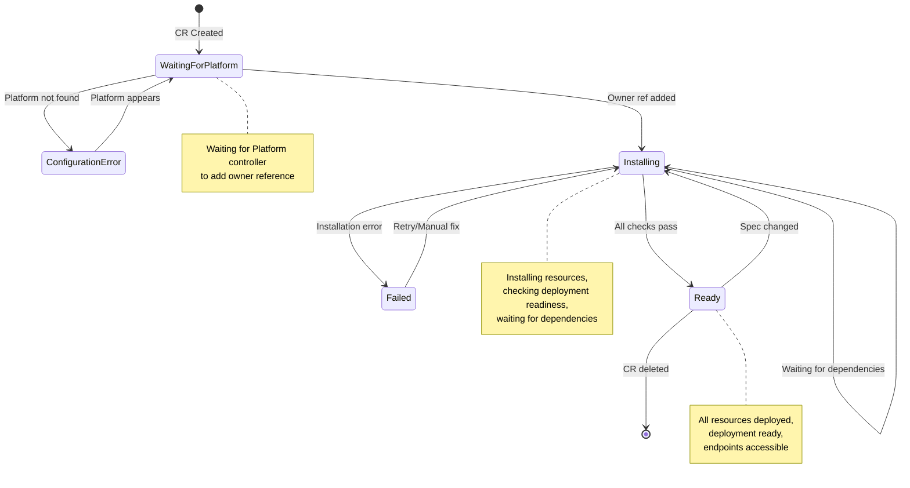
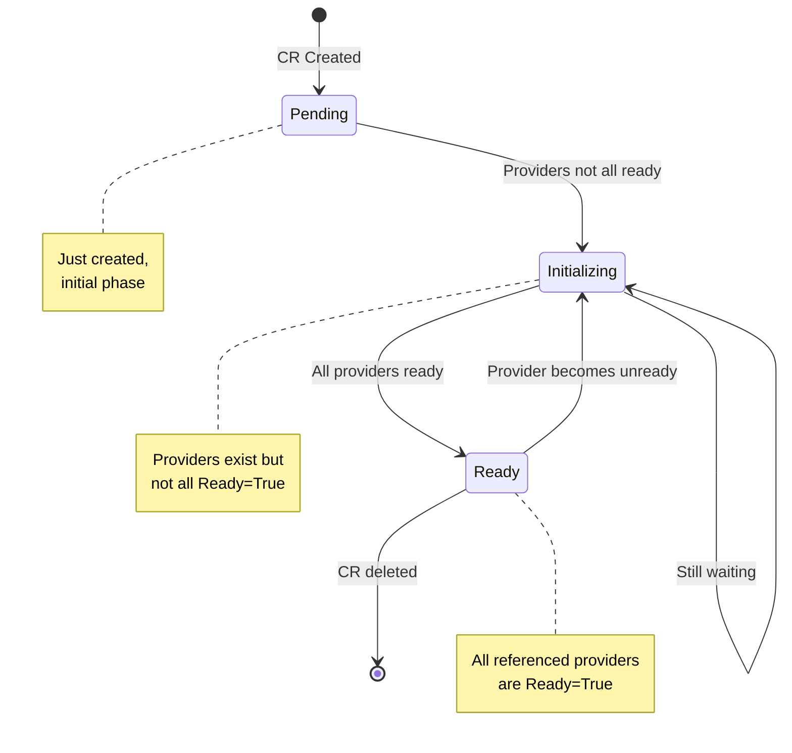
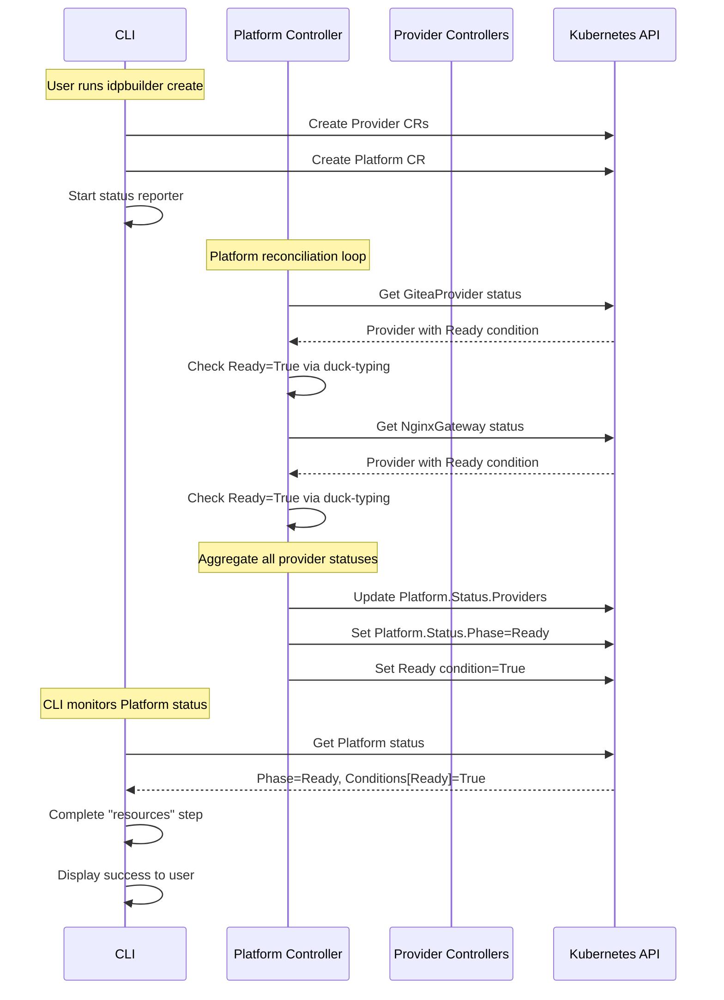

# Resource Creation Sequencing and State Transitions

**Version:** 1.0  
**Date:** December 22, 2024  
**Status:** Implementation Guide

## Executive Summary

This document describes the actual implementation of resource creation sequencing and state transitions in the idpbuilder controller-based architecture. The design emphasizes **controller-driven sequencing** where the CLI has minimal logic and controllers watch status of other resources to implement correct sequencing.

### Key Principles

1. **Controller-Driven Sequencing**: Controllers implement sequencing logic by watching status conditions of dependent resources
2. **Minimal CLI Logic**: CLI only creates CRs in a simple order; controllers handle all dependency management
3. **Status-Based Coordination**: Controllers use Kubernetes status conditions to communicate readiness and coordinate
4. **Declarative Dependencies**: Resource relationships expressed through owner references and CR references
5. **Autonomous Reconciliation**: Each controller independently determines when to proceed based on observed state

## Resource Creation Sequence

### CLI Responsibility (Minimal Logic)

The CLI creates resources in this simple order:

```go
// pkg/build/build.go - Run() method
func (b *Build) Run(ctx context.Context) error {
    // 1. Create Kind cluster (infrastructure)
    createKindCluster()
    
    // 2. Install controller manager
    installControllers()
    
    // 3. Create provider CRs (order doesn't matter - controllers handle dependencies)
    createGiteaProvider()      // Git provider
    createNginxGateway()       // Gateway provider  
    createArgoCDProvider()     // GitOps provider
    
    // 4. Create Platform CR (references all providers)
    createPlatform()
    
    // 5. Wait for Platform Ready status
    waitForPlatformReady()
    
    return nil
}
```

**Important**: The CLI does NOT implement sequencing logic. It creates CRs in a simple, static order. The controllers handle all dependency management and sequencing through status watching.

### Controller-Driven Sequencing Flow

```mermaid
sequenceDiagram
    participant CLI
    participant K8s as Kubernetes API
    participant Platform as PlatformReconciler
    participant Gitea as GiteaProviderReconciler
    participant Nginx as NginxGatewayReconciler
    participant ArgoCD as ArgoCDProviderReconciler

    Note over CLI: Phase 1: Resource Creation
    CLI->>K8s: Create GiteaProvider CR
    CLI->>K8s: Create NginxGateway CR
    CLI->>K8s: Create ArgoCDProvider CR
    CLI->>K8s: Create Platform CR<br/>(references all providers)

    Note over K8s,ArgoCD: Phase 2: Initial Reconciliation
    K8s->>Gitea: Reconcile GiteaProvider
    Gitea->>Gitea: Check for owner reference
    Note over Gitea: No owner ref found
    Gitea->>Gitea: Set Phase="WaitingForPlatform"
    Gitea->>K8s: Update status (Ready=False)

    K8s->>Nginx: Reconcile NginxGateway
    Nginx->>Nginx: Check for owner reference
    Note over Nginx: No owner ref found
    Nginx->>Nginx: Set Phase="WaitingForPlatform"
    Nginx->>K8s: Update status (Ready=False)

    K8s->>ArgoCD: Reconcile ArgoCDProvider
    ArgoCD->>ArgoCD: Check for owner reference
    Note over ArgoCD: No owner ref found
    ArgoCD->>ArgoCD: Set Phase="WaitingForPlatform"
    ArgoCD->>K8s: Update status (Ready=False)

    Note over Platform: Phase 3: Platform Establishes Ownership
    K8s->>Platform: Reconcile Platform
    Platform->>K8s: Get GiteaProvider
    Platform->>Platform: Add Platform as owner reference
    Platform->>K8s: Update GiteaProvider (add ownerRef)
    
    Platform->>K8s: Get NginxGateway
    Platform->>Platform: Add Platform as owner reference
    Platform->>K8s: Update NginxGateway (add ownerRef)
    
    Platform->>K8s: Get ArgoCDProvider
    Platform->>Platform: Add Platform as owner reference
    Platform->>K8s: Update ArgoCDProvider (add ownerRef)

    Note over Gitea,ArgoCD: Phase 4: Provider Installation
    K8s->>Gitea: Reconcile GiteaProvider
    Gitea->>Gitea: Check owner reference
    Note over Gitea: Owner ref found!
    Gitea->>K8s: Get Platform CR
    Gitea->>Gitea: Discover config from Platform.Spec.Domain
    Gitea->>Gitea: Wait for Nginx webhook
    Gitea->>K8s: Check Nginx service endpoints
    Note over Gitea: Nginx not ready yet
    Gitea->>Gitea: Set Phase="Installing"
    Gitea->>K8s: Update status (Ready=False)

    K8s->>Nginx: Reconcile NginxGateway
    Nginx->>Nginx: Check owner reference
    Note over Nginx: Owner ref found!
    Nginx->>K8s: Get Platform CR
    Nginx->>Nginx: Discover config from Platform
    Nginx->>Nginx: Install Nginx resources
    Nginx->>K8s: Create Namespace
    Nginx->>K8s: Create Deployment, Service, etc.
    Nginx->>Nginx: Check deployment readiness
    Note over Nginx: Deployment ready
    Nginx->>Nginx: Set Phase="Ready"
    Nginx->>K8s: Update status (Ready=True)

    K8s->>Gitea: Reconcile GiteaProvider
    Gitea->>K8s: Check Nginx service endpoints
    Note over Gitea: Nginx ready now!
    Gitea->>K8s: Install Gitea resources
    Gitea->>Gitea: Check deployment readiness
    Note over Gitea: Deployment ready
    Gitea->>Gitea: Set Phase="Ready"
    Gitea->>K8s: Update status (Ready=True)

    K8s->>ArgoCD: Reconcile ArgoCDProvider
    ArgoCD->>ArgoCD: Check owner reference
    Note over ArgoCD: Owner ref found!
    ArgoCD->>K8s: Get Platform CR
    ArgoCD->>ArgoCD: Discover config from Platform
    ArgoCD->>K8s: Install ArgoCD resources
    ArgoCD->>ArgoCD: Check deployment readiness
    Note over ArgoCD: Deployment ready
    ArgoCD->>ArgoCD: Set Phase="Ready"
    ArgoCD->>K8s: Update status (Ready=True)

    Note over Platform: Phase 5: Platform Aggregation
    K8s->>Platform: Reconcile Platform
    Platform->>K8s: Get GiteaProvider status
    Note over Platform: Gitea Ready=True
    Platform->>K8s: Get NginxGateway status
    Note over Platform: Nginx Ready=True
    Platform->>K8s: Get ArgoCDProvider status
    Note over Platform: ArgoCD Ready=True
    Platform->>Platform: All providers ready!
    Platform->>Platform: Set Phase="Ready"
    Platform->>K8s: Update status (Ready=True)
```



## State Transitions

### Provider State Machine (Common Pattern)

All providers (GiteaProvider, NginxGateway, ArgoCDProvider) follow this state machine:



### Platform State Machine



## Detailed State Transitions by Resource

### GiteaProvider State Transitions

#### File: `pkg/controllers/gitprovider/giteaprovider_controller.go`

| From State | To State | Trigger | Condition Check | Code Location |
|------------|----------|---------|-----------------|---------------|
| `""` (empty) | `WaitingForPlatform` | No owner reference | `GetPlatformOwnerReference() == nil` | Line 88-105 |
| `WaitingForPlatform` | `ConfigurationError` | Platform not found | Platform Get returns NotFound | Line 114-130 |
| `WaitingForPlatform` | `Installing` | Owner ref added | Owner reference exists | Line 142-152 |
| `Installing` | `Failed` | Installation error | `reconcileGitea()` returns error | Line 156-172 |
| `Installing` | `Installing` | Waiting for Nginx | `isNginxAdmissionWebhookReady() == false` | Line 310-328 |
| `Installing` | `Installing` | Deployment not ready | `isGiteaReady() == false` | Line 184-213 |
| `Installing` | `Ready` | All checks pass | Deployment ready + API accessible | Line 215-266 |

**Status Conditions:**

```go
// Set throughout reconciliation
Conditions:
  - Type: Ready
    Status: True/False
    Reason: GiteaReady / WaitingForPlatform / ConfigurationError / InstallationFailed
    
  - Type: NamespaceReady
    Status: True/False
    Reason: NamespaceExists / NamespaceCreationFailed
    
  - Type: AdminSecretReady
    Status: True/False
    Reason: AdminSecretExists / AdminSecretCreationFailed
    
  - Type: NginxWebhookReady
    Status: True/False/Unknown
    Reason: WebhookReady / WebhookNotReady / WebhookCheckFailed
    
  - Type: ResourcesInstalled
    Status: True/False
    Reason: ResourcesApplied / InstallationFailed
    
  - Type: DeploymentReady
    Status: True/False/Unknown
    Reason: DeploymentAvailable / DeploymentNotFound / NoAvailableReplicas
    
  - Type: APIAccessible
    Status: True/False
    Reason: APIReady / APINotAccessible / APINotReady
```

### NginxGateway State Transitions

#### File: `pkg/controllers/gatewayprovider/nginxgateway_controller.go`

| From State | To State | Trigger | Condition Check | Code Location |
|------------|----------|---------|-----------------|---------------|
| `""` (empty) | `WaitingForPlatform` | No owner reference | `GetPlatformOwnerReference() == nil` | Line 81-94 |
| `WaitingForPlatform` | `ConfigurationError` | Platform not found | Platform Get returns NotFound | Line 103-116 |
| `WaitingForPlatform` | `Installing` | Owner ref added | Owner reference exists | Line 126-131 |
| `Installing` | `Failed` | Installation error | `reconcileNginx()` returns error | Line 135-148 |
| `Installing` | `Installing` | Deployment not ready | `isNginxReady() == false` | Line 151-178 |
| `Installing` | `Installing` | Service not ready | `isServiceReady() == false` | Line 189-216 |
| `Installing` | `Ready` | All checks pass | Deployment + Service ready | Line 226-271 |

**Status Conditions:**

```go
Conditions:
  - Type: Ready
    Status: True/False
    Reason: NginxReady / WaitingForPlatform / ConfigurationError / InstallationFailed
    
  - Type: NamespaceReady
    Status: True/False
    Reason: NamespaceCreated / NamespaceCreationFailed
    
  - Type: ResourcesInstalled
    Status: True/False
    Reason: ResourcesInstalled / ResourceInstallationFailed
    
  - Type: DeploymentReady
    Status: True/False/Unknown
    Reason: DeploymentReady / DeploymentNotReady / DeploymentCheckFailed
    
  - Type: ServiceReady
    Status: True/False/Unknown
    Reason: ServiceReady / ServiceNotReady / ServiceCheckFailed
```

### ArgoCDProvider State Transitions

#### File: `pkg/controllers/gitopsprovider/argocdprovider_controller.go`

| From State | To State | Trigger | Condition Check | Code Location |
|------------|----------|---------|-----------------|---------------|
| `""` (empty) | `WaitingForPlatform` | No owner reference | `GetPlatformOwnerReference() == nil` | Line 64-78 |
| `WaitingForPlatform` | `ConfigurationError` | Platform not found | Platform Get returns NotFound | Line 86-101 |
| `WaitingForPlatform` | `Pending` | Owner ref added | Owner reference exists | Line 111-117 |
| `Pending` | `Failed` | Installation error | `installArgoCD()` returns error | Line 120-134 |
| `Pending` | `Installing` | Deployment not ready | `isArgoCDReady() == false` | Line 159-182 |
| `Installing` | `Ready` | All checks pass | Deployment + Service ready | Line 184-192 |

**Status Conditions:**

```go
Conditions:
  - Type: Ready
    Status: True/False
    Reason: ArgoCDInstalled / WaitingForPlatform / ConfigurationError / InstallationFailed
    
  - Type: NamespaceReady
    Status: True/False
    Reason: NamespaceExists / NamespaceCreationFailed
    
  - Type: ResourcesInstalled
    Status: True/False
    Reason: ResourcesApplied / ManifestBuildFailed / ResourceCreationFailed
    
  - Type: AdminSecretReady
    Status: True/False
    Reason: AdminSecretExists / AdminSecretCreated / AdminSecretCreationFailed
    
  - Type: DeploymentReady
    Status: True/False/Unknown
    Reason: DeploymentAvailable / DeploymentNotFound / NoAvailableReplicas
    
  - Type: APIAccessible
    Status: True/False/Unknown
    Reason: ServiceReady / ServiceNotFound / ServiceCheckFailed
```

### Platform State Transitions

#### File: `pkg/controllers/platform/platform_controller.go`

| From State | To State | Trigger | Condition Check | Code Location |
|------------|----------|---------|-----------------|---------------|
| `""` (empty) | `Pending` | CR created | Phase is empty | Line 71-76 |
| `Pending` | `Initializing` | Not all providers ready | Any provider Ready=False | Line 124-140 |
| `Initializing` | `Initializing` | Still waiting | Not all providers ready | Line 146-149 |
| `Initializing` | `Ready` | All providers ready | All providers Ready=True | Line 124-132 |

**Status Conditions:**

```go
Conditions:
  - Type: Ready
    Status: True/False
    Reason: AllComponentsReady / ComponentsNotReady
```

## Controller Watching Patterns

### 1. Owner Reference Pattern (Primary Sequencing Mechanism)

**Purpose**: Providers wait for Platform to establish ownership before proceeding

**Implementation**:
```go
// pkg/controllers/gitprovider/giteaprovider_controller.go
// Lines 88-105

// Check for Platform owner reference
platformRef := providerutil.GetPlatformOwnerReference(provider)
if platformRef == nil {
    logger.Info("Waiting for Platform to add owner reference")
    meta.SetStatusCondition(&provider.Status.Conditions, metav1.Condition{
        Type:    "Ready",
        Status:  metav1.ConditionFalse,
        Reason:  "WaitingForPlatform",
        Message: "Waiting for Platform resource to add owner reference",
    })
    provider.Status.Phase = "WaitingForPlatform"
    if err := r.Status().Update(ctx, provider); err != nil {
        return ctrl.Result{}, err
    }
    return ctrl.Result{RequeueAfter: defaultRequeueTime}, nil
}
```

**Platform Side**:
```go
// pkg/controllers/platform/platform_controller.go
// Lines 327-408

func (r *PlatformReconciler) ensureProviderOwnerReferences(ctx context.Context, platform *v1alpha2.Platform) error {
    // Process all Git providers
    for _, providerRef := range platform.Spec.Components.GitProviders {
        if err := r.ensureOwnerReference(ctx, platform, providerRef); err != nil {
            return err
        }
    }
    // ... similar for Gateways and GitOps providers
}

func (r *PlatformReconciler) ensureOwnerReference(ctx context.Context, platform *v1alpha2.Platform, providerRef v1alpha2.ProviderReference) error {
    // Fetch provider
    provider := &unstructured.Unstructured{}
    // ... 
    
    // Check if Platform is already an owner
    hasOwnerRef := false
    for _, ref := range provider.GetOwnerReferences() {
        if ref.UID == platform.UID {
            hasOwnerRef = true
            break
        }
    }
    
    if !hasOwnerRef {
        // Add Platform as owner reference
        ownerRef := metav1.OwnerReference{
            APIVersion: platform.APIVersion,
            Kind:       platform.Kind,
            Name:       platform.Name,
            UID:        platform.UID,
            Controller: func() *bool { b := false; return &b }(),
        }
        // Update provider with owner reference
    }
}
```

### 2. Status Aggregation Pattern (Platform Monitors Providers)

**Purpose**: Platform watches provider status to determine overall readiness

**Implementation**:
```go
// pkg/controllers/platform/platform_controller.go
// Lines 86-118

// Aggregate Git Providers
gitProviderStatuses, gitReady, err := r.aggregateGitProviders(ctx, platform)
if err != nil {
    logger.Error(err, "Failed to aggregate git providers")
    return ctrl.Result{RequeueAfter: defaultRequeueTime}, nil
}
platform.Status.Providers.GitProviders = gitProviderStatuses
if !gitReady {
    allReady = false
}

// Similar for Gateway and GitOps providers...

// Set condition and phase based on provider readiness
if allReady && len(platform.Spec.Components.GitProviders) > 0 {
    platform.Status.Phase = "Ready"
    meta.SetStatusCondition(&platform.Status.Conditions, metav1.Condition{
        Type:    "Ready",
        Status:  metav1.ConditionTrue,
        Reason:  "AllComponentsReady",
        Message: "All platform components are operational",
    })
} else {
    platform.Status.Phase = "Initializing"
    // ...
}
```

**Provider Status Checking**:
```go
// pkg/controllers/platform/platform_controller.go
// Lines 156-210

func (r *PlatformReconciler) aggregateGitProviders(ctx context.Context, platform *v1alpha2.Platform) ([]v1alpha2.ProviderStatusSummary, bool, error) {
    summaries := []v1alpha2.ProviderStatusSummary{}
    allReady := true
    
    for _, gitProviderRef := range platform.Spec.Components.GitProviders {
        // Fetch provider using unstructured client (duck-typing)
        providerObj := &unstructured.Unstructured{}
        // ...
        
        // Extract status using duck-typing
        ready, err := provider.IsGitProviderReady(providerObj)
        
        summaries = append(summaries, v1alpha2.ProviderStatusSummary{
            Name:  gitProviderRef.Name,
            Kind:  gitProviderRef.Kind,
            Ready: ready,
        })
        
        if !ready {
            allReady = false
        }
    }
    
    return summaries, allReady, nil
}
```

### 3. Cross-Provider Dependency Pattern (Providers Watch Each Other)

**Purpose**: Providers check status of other providers they depend on

**Example**: GiteaProvider waits for NginxGateway webhook to be ready

**Implementation**:
```go
// pkg/controllers/gitprovider/giteaprovider_controller.go
// Lines 308-336

// Check if nginx admission webhook is ready before creating Ingress resources
ready, err := r.isNginxAdmissionWebhookReady(ctx)
if err != nil {
    logger.V(1).Info("Failed to check nginx admission webhook readiness", "error", err)
    meta.SetStatusCondition(&provider.Status.Conditions, metav1.Condition{
        Type:    "NginxWebhookReady",
        Status:  metav1.ConditionUnknown,
        Reason:  "WebhookCheckFailed",
        Message: "Unable to verify nginx webhook readiness",
    })
} else if !ready {
    logger.Info("Nginx admission webhook not ready yet, requeuing to prevent race condition")
    meta.SetStatusCondition(&provider.Status.Conditions, metav1.Condition{
        Type:    "NginxWebhookReady",
        Status:  metav1.ConditionFalse,
        Reason:  "WebhookNotReady",
        Message: "Waiting for nginx admission webhook to be ready",
    })
    return ctrl.Result{RequeueAfter: defaultRequeueTime}, nil
}
```

**Dependency Check Implementation**:
```go
// pkg/controllers/gitprovider/giteaprovider_controller.go
// Lines 646-697

func (r *GiteaProviderReconciler) isNginxAdmissionWebhookReady(ctx context.Context) (bool, error) {
    // Check if the nginx admission webhook service exists
    service := &corev1.Service{}
    err := r.Get(ctx, types.NamespacedName{
        Namespace: nginxNamespace,
        Name:      nginxAdmissionWebhookServiceName,
    }, service)
    
    if err != nil {
        if errors.IsNotFound(err) {
            return false, nil
        }
        return false, err
    }
    
    // Check if the service has endpoints (webhook pod is ready)
    endpoints := &corev1.Endpoints{}
    err = r.Get(ctx, types.NamespacedName{
        Namespace: nginxNamespace,
        Name:      nginxAdmissionWebhookServiceName,
    }, endpoints)
    
    // Check for ready addresses in endpoints
    for _, subset := range endpoints.Subsets {
        if len(subset.Addresses) > 0 {
            return true, nil
        }
    }
    
    return false, nil
}
```

### 4. Configuration Discovery Pattern (Providers Read Platform Spec)

**Purpose**: Providers discover configuration from Platform after owner reference is established

**Implementation**:
```go
// pkg/controllers/gitprovider/giteaprovider_controller.go
// Lines 108-139

// Get Platform resource for configuration discovery
platform := &v1alpha2.Platform{}
platformKey := types.NamespacedName{
    Name:      platformRef.Name,
    Namespace: provider.Namespace,
}
if err := r.Get(ctx, platformKey, platform); err != nil {
    if errors.IsNotFound(err) {
        logger.Info("Platform resource not found", "platform", platformRef.Name)
        meta.SetStatusCondition(&provider.Status.Conditions, metav1.Condition{
            Type:    "Ready",
            Status:  metav1.ConditionFalse,
            Reason:  "PlatformNotFound",
            Message: fmt.Sprintf("Platform %s not found", platformRef.Name),
        })
        provider.Status.Phase = "ConfigurationError"
        return ctrl.Result{RequeueAfter: defaultRequeueTime}, nil
    }
    return ctrl.Result{}, err
}

// Discover configuration from Platform
logger.V(1).Info("Platform configuration available", "domain", platform.Spec.Domain)
// In the future: Use platform.Spec.Domain to configure provider endpoints
```

## Requeue and Retry Logic

### Default Requeue Time

All controllers use a consistent default requeue time:

```go
const defaultRequeueTime = time.Second * 30
```

### When to Requeue

1. **Waiting for Dependencies**:
   ```go
   // Waiting for owner reference
   return ctrl.Result{RequeueAfter: defaultRequeueTime}, nil
   ```

2. **Resource Not Ready**:
   ```go
   // Deployment not ready yet
   logger.Info("Nginx not ready yet, requeuing")
   return ctrl.Result{RequeueAfter: defaultRequeueTime}, nil
   ```

3. **Temporary Errors** (non-critical):
   ```go
   // Failed to aggregate providers (not fatal)
   logger.Error(err, "Failed to aggregate git providers")
   return ctrl.Result{RequeueAfter: defaultRequeueTime}, nil
   ```

### When NOT to Requeue (Return Error)

1. **Fatal Errors**:
   ```go
   // Fatal error - let controller-runtime handle retry with backoff
   if err := r.Get(ctx, req.NamespacedName, provider); err != nil {
       return ctrl.Result{}, err
   }
   ```

2. **Update Conflicts**:
   ```go
   if err := r.Update(ctx, provider); err != nil {
       // Conflict errors trigger immediate retry
       if errors.IsConflict(err) {
           return ctrl.Result{}, err
       }
       return ctrl.Result{}, err
   }
   ```

## Error Handling Patterns

### 1. Transient Errors (Requeue)

```go
// Resource not found - might appear later
if errors.IsNotFound(err) {
    logger.Info("Resource not found, will retry")
    return ctrl.Result{RequeueAfter: defaultRequeueTime}, nil
}
```

### 2. Conflict Errors (Immediate Retry)

```go
// Resource was modified - retry immediately
if err := r.Status().Update(ctx, provider); err != nil {
    if errors.IsConflict(err) {
        return ctrl.Result{}, err  // Immediate retry
    }
    return ctrl.Result{}, err
}
```

### 3. Fatal Errors (Update Status and Return)

```go
if err := r.reconcileGitea(ctx, provider); err != nil {
    // Set status to Failed
    meta.SetStatusCondition(&provider.Status.Conditions, metav1.Condition{
        Type:    "Ready",
        Status:  metav1.ConditionFalse,
        Reason:  "InstallationFailed",
        Message: err.Error(),
    })
    provider.Status.Phase = "Failed"
    if statusErr := r.Status().Update(ctx, provider); statusErr != nil {
        logger.Error(statusErr, "Failed to update status")
    }
    return ctrl.Result{}, err
}
```

## Duck Typing for Provider Independence

### Provider Status Fields (Duck-Typed)

All providers expose standard status fields that other controllers can rely on:

**Git Providers (Gitea, GitHub, GitLab)**:
```go
type GitProviderStatus struct {
    Endpoint             string           // External URL
    InternalEndpoint     string           // Cluster-internal URL
    CredentialsSecretRef *SecretReference // Credentials
    // ... provider-specific fields
}
```

**Gateway Providers (Nginx, Traefik, etc.)**:
```go
type GatewayProviderStatus struct {
    IngressClassName     string // Ingress class to use
    LoadBalancerEndpoint string // External endpoint
    InternalEndpoint     string // Cluster-internal API
    // ... provider-specific fields
}
```

**GitOps Providers (ArgoCD, Flux, etc.)**:
```go
type GitOpsProviderStatus struct {
    Endpoint             string           // External URL
    InternalEndpoint     string           // Cluster-internal URL
    CredentialsSecretRef *SecretReference // Credentials
    // ... provider-specific fields
}
```

### Duck-Typing Helper Functions

```go
// pkg/util/provider/duck_typing.go

// IsGitProviderReady checks if a git provider is ready using duck-typing
func IsGitProviderReady(obj *unstructured.Unstructured) (bool, error) {
    // Check for Ready condition
    conditions, found, err := unstructured.NestedSlice(obj.Object, "status", "conditions")
    if err != nil || !found {
        return false, nil
    }
    
    // Look for Ready=True condition
    for _, condition := range conditions {
        condMap, ok := condition.(map[string]interface{})
        if !ok {
            continue
        }
        
        condType, _, _ := unstructured.NestedString(condMap, "type")
        condStatus, _, _ := unstructured.NestedString(condMap, "status")
        
        if condType == "Ready" && condStatus == "True" {
            return true, nil
        }
    }
    
    return false, nil
}

// Similar functions for IsGatewayProviderReady and IsGitOpsProviderReady
```

## Testing the Sequencing

### Unit Tests

Test individual state transitions:

```go
func TestGiteaProvider_WaitForOwnerReference(t *testing.T) {
    // Test that provider waits when no owner reference
    provider := &v1alpha2.GiteaProvider{
        ObjectMeta: metav1.ObjectMeta{
            Name:      "test-gitea",
            Namespace: "default",
        },
    }
    
    // Reconcile should set WaitingForPlatform phase
    result, err := reconciler.Reconcile(ctx, request)
    
    assert.NoError(t, err)
    assert.Equal(t, time.Second*30, result.RequeueAfter)
    assert.Equal(t, "WaitingForPlatform", provider.Status.Phase)
}
```

### Integration Tests

Test multi-controller sequencing:

```go
func TestPlatformToProviderSequencing(t *testing.T) {
    // Create providers
    gitea := createGiteaProvider()
    nginx := createNginxGateway()
    
    // Create platform referencing providers
    platform := createPlatform(gitea, nginx)
    
    // Wait for platform to add owner references
    eventually(func() bool {
        hasOwnerRef := checkOwnerReference(gitea, platform)
        return hasOwnerRef
    })
    
    // Wait for providers to become ready
    eventually(func() bool {
        return gitea.Status.Phase == "Ready" && nginx.Status.Phase == "Ready"
    })
    
    // Wait for platform to aggregate status
    eventually(func() bool {
        return platform.Status.Phase == "Ready"
    })
}
```

## Client Resource Tracking Implementation

This section describes how the platform controller tracks provider statuses and how the CLI monitors the platform to display status to users.

### Platform Controller Provider Status Tracking

The Platform controller is responsible for tracking the ready status of all providers it references and aggregating this information into the Platform resource's status fields.

#### Provider Discovery and Reference

The Platform controller discovers providers through the Platform CR's spec:

```go
// api/v1alpha2/platform_types.go
type PlatformComponents struct {
    GitProviders    []ProviderReference `json:"gitProviders,omitempty"`
    Gateways        []ProviderReference `json:"gateways,omitempty"`
    GitOpsProviders []ProviderReference `json:"gitOpsProviders,omitempty"`
}

type ProviderReference struct {
    Name      string `json:"name"`      // Name of the provider CR
    Kind      string `json:"kind"`      // Kind (e.g., GiteaProvider, NginxGateway)
    Namespace string `json:"namespace"` // Namespace where provider exists
}
```

#### Status Tracking Flow

**File:** `pkg/controllers/platform/platform_controller.go`

The Platform controller's reconciliation loop tracks provider status through these steps:

1. **Fetch Each Provider Using Duck-Typing**
   ```go
   // Lines 161-175: aggregateGitProviders example
   for _, gitProviderRef := range platform.Spec.Components.GitProviders {
       // Use unstructured client for duck-typing
       gvk := schema.GroupVersionKind{
           Group:   "idpbuilder.cnoe.io",
           Version: "v1alpha2",
           Kind:    gitProviderRef.Kind,
       }
       
       providerObj := &unstructured.Unstructured{}
       providerObj.SetGroupVersionKind(gvk)
       
       err := r.Get(ctx, types.NamespacedName{
           Name:      gitProviderRef.Name,
           Namespace: gitProviderRef.Namespace,
       }, providerObj)
   }
   ```

2. **Check Ready Condition via Duck-Typing**
   
   The Platform controller uses duck-typing helpers to check if each provider is ready by examining the `Ready` condition in the provider's status:
   
   ```go
   // Line 192: Extract ready status
   ready, err := provider.IsGitProviderReady(providerObj)
   ```
   
   **Duck-Typing Implementation** (`pkg/util/provider/git.go`):
   ```go
   // Lines 103-109
   func IsGitProviderReady(obj *unstructured.Unstructured) (bool, error) {
       status, err := GetGitProviderStatus(obj)
       if err != nil {
           return false, err
       }
       return status.Ready, nil
   }
   ```
   
   The `GetGitProviderStatus` function (lines 34-100) extracts the Ready condition:
   ```go
   // Extract conditions from status
   conditions, found, err := unstructured.NestedSlice(obj.Object, "status", "conditions")
   
   // Look for Ready condition with Status=True
   for _, condition := range conditions {
       condMap := condition.(map[string]interface{})
       if condMap["type"] == "Ready" && condMap["status"] == "True" {
           status.Ready = true
           break
       }
   }
   ```
   
   Similar functions exist for:
   - `IsGatewayProviderReady()` in `pkg/util/provider/gateway.go`
   - `IsGitOpsProviderReady()` in `pkg/util/provider/gitops.go`

3. **Aggregate into Status Summary**
   
   Each provider's status is summarized in the Platform status:
   
   ```go
   // Lines 198-202
   summaries = append(summaries, v1alpha2.ProviderStatusSummary{
       Name:  gitProviderRef.Name,
       Kind:  gitProviderRef.Kind,
       Ready: ready,
   })
   ```

4. **Update Platform Status Fields**
   
   The aggregated provider statuses are stored in the Platform resource:
   
   ```go
   // Lines 93, 104, 115: Update status fields
   platform.Status.Providers.GitProviders = gitProviderStatuses
   platform.Status.Providers.Gateways = gatewayStatuses
   platform.Status.Providers.GitOpsProviders = gitopsStatuses
   ```

#### Platform Status Structure

The Platform status contains aggregated provider information:

```go
// api/v1alpha2/platform_types.go
type PlatformStatus struct {
    // Conditions include the overall Ready condition
    Conditions []metav1.Condition `json:"conditions,omitempty"`
    
    // Providers contains aggregated status of all referenced providers
    Providers PlatformProviderStatus `json:"providers,omitempty"`
    
    // Phase represents current state: Pending, Initializing, or Ready
    Phase string `json:"phase,omitempty"`
    
    ObservedGeneration int64 `json:"observedGeneration,omitempty"`
}

type PlatformProviderStatus struct {
    GitProviders    []ProviderStatusSummary `json:"gitProviders,omitempty"`
    Gateways        []ProviderStatusSummary `json:"gateways,omitempty"`
    GitOpsProviders []ProviderStatusSummary `json:"gitOpsProviders,omitempty"`
}

type ProviderStatusSummary struct {
    Name  string `json:"name"`  // Provider name
    Kind  string `json:"kind"`  // Provider kind
    Ready bool   `json:"ready"` // Whether provider is ready
}
```

#### Ready Condition Logic

The Platform sets its overall `Ready` condition based on all provider statuses:

```go
// Lines 124-140
if allReady && len(platform.Spec.Components.GitProviders) > 0 {
    platform.Status.Phase = "Ready"
    meta.SetStatusCondition(&platform.Status.Conditions, metav1.Condition{
        Type:    "Ready",
        Status:  metav1.ConditionTrue,
        Reason:  "AllComponentsReady",
        Message: "All platform components are operational",
    })
} else {
    platform.Status.Phase = "Initializing"
    meta.SetStatusCondition(&platform.Status.Conditions, metav1.Condition{
        Type:    "Ready",
        Status:  metav1.ConditionFalse,
        Reason:  "ComponentsNotReady",
        Message: "Waiting for platform components to be ready",
    })
}
```

### CLI Status Tracking and Display

The CLI tracks the Platform resource status to display progress to the user.

#### Status Reporter Integration

**File:** `pkg/build/build.go`

The CLI uses a status reporter to display workflow steps to users:

```go
// Lines 172-186: Example status reporting
if b.statusReporter != nil {
    b.statusReporter.StartStep("cluster")
}
if err := b.ReconcileKindCluster(ctx, recreateCluster); err != nil {
    if b.statusReporter != nil {
        b.statusReporter.FailStep("cluster", err)
    }
    return err
}
if b.statusReporter != nil {
    b.statusReporter.CompleteStep("cluster")
}
```

#### Status Reporter Implementation

**File:** `pkg/status/reporter.go`

The Reporter provides inline status updates with color coding:

```go
// Lines 56-65
type Reporter struct {
    steps      []Step      // Workflow steps
    currentIdx int         // Current step index
    writer     io.Writer   // Output destination
    colored    bool        // Enable colors
    simpleMode bool        // Simple vs. inline mode
}

type Step struct {
    Name        string      // Step identifier
    Description string      // User-visible description
    State       State       // Pending, Running, Complete, or Failed
    StartTime   time.Time
    EndTime     time.Time
    SubSteps    []SubStep   // Sub-tasks within step
}
```

States available:
```go
const (
    StatePending  State = iota  // Not started
    StateRunning                // In progress
    StateComplete               // Successfully completed
    StateFailed                 // Failed with error
)
```

#### Platform Status Monitoring Flow

The CLI monitors Platform status through this sequence:

1. **Create Platform CR**
   
   The CLI creates the Platform CR referencing all providers

2. **Monitor Platform Phase**
   
   The CLI can track the Platform's phase transitions:
   - `Pending` → Initial creation
   - `Initializing` → Providers exist but not all ready
   - `Ready` → All providers are ready

3. **Display Status to User**
   
   The status reporter shows the workflow progress:
   ```
   ✓ cluster         Creating kind cluster
   ✓ crds            Adding CRDs to cluster
   ✓ networking      Setting up CoreDNS and TLS
   ⟳ resources       Deploying platform components
     └─ gitea        Installing git provider
     └─ nginx        Installing gateway
     └─ argocd       Installing GitOps provider
   ```

4. **Check Individual Provider Status**
   
   The Platform status provides detailed provider readiness:
   ```yaml
   status:
     phase: Initializing
     providers:
       gitProviders:
       - name: gitea
         kind: GiteaProvider
         ready: true
       gateways:
       - name: nginx
         kind: NginxGateway
         ready: true
       gitOpsProviders:
       - name: argocd
         kind: ArgoCDProvider
         ready: false  # Still installing
     conditions:
     - type: Ready
       status: "False"
       reason: ComponentsNotReady
       message: "Waiting for platform components to be ready"
   ```

#### Status Display Progression

Users see the following progression as the platform initializes:

**Phase 1: Provider CRs Created**
- Platform phase: `Pending`
- Providers waiting for owner references
- CLI shows "Deploying platform components" in progress

**Phase 2: Providers Installing**
- Platform phase: `Initializing`
- Some providers ready, others still installing
- CLI can show individual provider status if implemented

**Phase 3: All Providers Ready**
- Platform phase: `Ready`
- All provider `Ready` conditions are `True`
- CLI completes "resources" step successfully

#### Future CLI Enhancements

While the current implementation uses the status reporter for high-level workflow steps, future enhancements could include:

1. **Real-time Provider Status Display**
   ```go
   // Monitor Platform status and update sub-steps
   for _, provider := range platform.Status.Providers.GitProviders {
       if provider.Ready {
           reporter.UpdateSubStep("resources", provider.Name, StateComplete)
       } else {
           reporter.UpdateSubStep("resources", provider.Name, StateRunning)
       }
   }
   ```

2. **Watch-based Status Updates**
   ```go
   // Watch Platform resource for status changes
   watcher, err := kubeClient.Watch(ctx, &v1alpha2.PlatformList{})
   for event := range watcher.ResultChan() {
       platform := event.Object.(*v1alpha2.Platform)
       updateStatusDisplay(platform.Status)
   }
   ```

3. **Detailed Condition Display**
   ```go
   // Show specific condition reasons for debugging
   for _, condition := range platform.Status.Conditions {
       if condition.Type == "Ready" && condition.Status == "False" {
           fmt.Printf("Waiting: %s\n", condition.Message)
       }
   }
   ```

### Key Implementation Files

| File | Purpose |
|------|---------|
| `pkg/controllers/platform/platform_controller.go` | Platform controller that tracks provider status |
| `pkg/util/provider/git.go` | Duck-typing utilities for Git providers |
| `pkg/util/provider/gateway.go` | Duck-typing utilities for Gateway providers |
| `pkg/util/provider/gitops.go` | Duck-typing utilities for GitOps providers |
| `api/v1alpha2/platform_types.go` | Platform and provider status type definitions |
| `pkg/build/build.go` | CLI build orchestration with status reporting |
| `pkg/status/reporter.go` | CLI status reporter implementation |

### Tracking Flow Summary



## Summary

### Key Sequencing Mechanisms

1. **Owner Reference Pattern**: Providers wait for Platform to establish ownership
2. **Status Aggregation**: Platform watches provider status to determine overall readiness
3. **Cross-Provider Dependencies**: Providers check other providers' status when needed
4. **Configuration Discovery**: Providers read Platform spec for configuration
5. **Requeue Logic**: Controllers use consistent requeue times for coordination

### CLI Responsibilities (Minimal)

- Create Kind cluster
- Install controllers
- Create provider CRs (simple order)
- Create Platform CR
- Wait for ready status

### Controller Responsibilities (Comprehensive)

- Implement all sequencing logic
- Watch status of dependent resources
- Manage state transitions
- Update status conditions
- Handle errors and retries
- Coordinate through Kubernetes API

This design ensures that the CLI remains simple and the controllers are autonomous, following Kubernetes best practices for controller design and resource coordination.

## Related Documentation

- [Controller Architecture Spec](./controller-architecture-spec.md) - High-level architecture design
- [Architecture Transition Guide](../implementation/architecture-transition.md) - Migration from v1alpha1 to v1alpha2
- [Next Steps to Remove Localbuild](../implementation/next-steps-remove-localbuild.md) - Implementation roadmap
